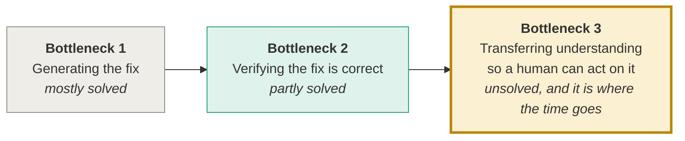
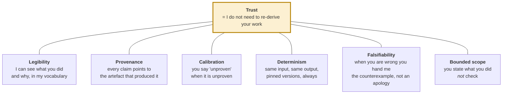
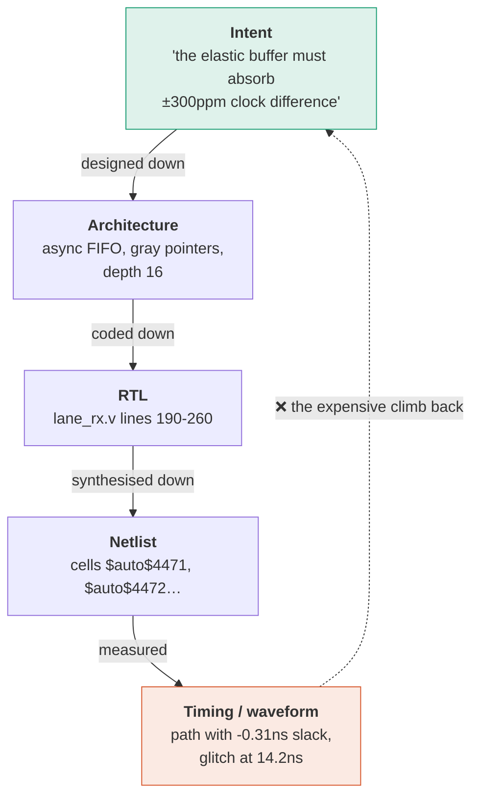
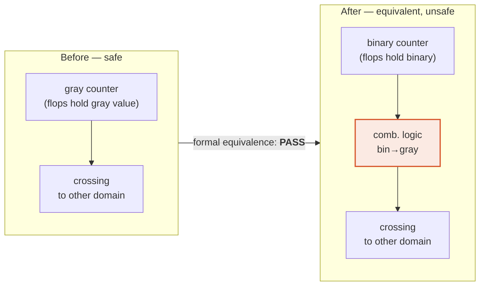
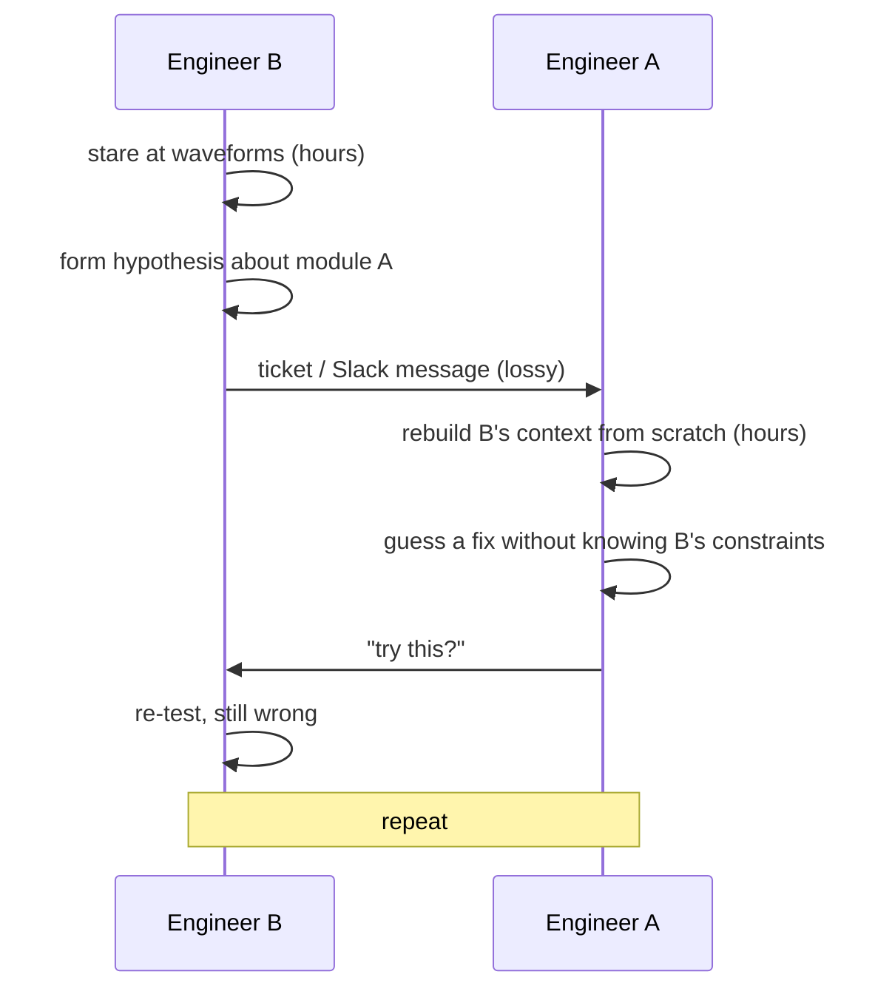
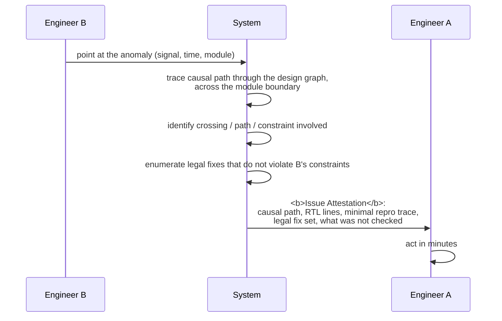

# 00 — Vision: what we are actually building

> Read this once, slowly, before writing any code. Every design decision downstream follows from it.

---

## 1. Three bottlenecks, and only the third one matters

Most people looking at this problem see the first bottleneck. Some see the second. Almost nobody builds for the third.

**Bottleneck 1 — generation.** Language models write plausible RTL. Several published systems already loop a model against EDA tools. This is table stakes and it is not where we win.

**Bottleneck 2 — verification.** Does the change compute the same thing? Formal equivalence checking answers this, and every serious system uses it. Necessary. Not sufficient — see §4.

**Bottleneck 3 — representation.** *An AI that identifies a real problem is worthless if a human needs ten hours to understand the finding.* The cost of a change is not the cost of making it. It is the cost of a human acquiring enough understanding to sign their name under it.

This is the bottleneck we are building for, and it is worth being precise about why it is the expensive one.

### The arithmetic that should decide your priorities

Industry survey data over two decades is consistent:

- Verification and debug consume roughly **60–70% of total chip project effort**.
- Design engineers spend close to **half their own time on verification**, not design.
- NVIDIA's ChipNeMo paper reports internal findings that up to **60% of a chip designer's time** goes to debug and checklist work.
- Only **14% of ASIC projects achieved first-silicon success** in 2024 — the lowest figure recorded in more than twenty years.

Now the uncomfortable implication:

> If our system emits 50 patches and each costs an engineer 40 minutes of careful review,
> we have not saved 33 hours of work. **We have created 33 hours of work.**
> We automated the cheap part and multiplied the expensive part.

Every published system in this space has this problem. **None of them measure it**, because measuring it would expose the weakness. We measure it (see [M13](modules/M13-evaluation.md)) and we build to reduce it.

---

## 2. The Jarvis property

Stark does not double-check Jarvis. Not because Jarvis is infallible, but because Jarvis has a property we can actually engineer.

Trust is not a feeling. It is the *absence of a need to re-derive*. It decomposes into six mechanical properties, and every one of them is a build requirement:

Map each to something in this repo:

| Property | Where it lives | Failure if absent |
|---|---|---|
| Legibility | [M03](modules/M03-design-graph.md) traceability, [M11](modules/M11-console.md) rendering | "Gate `$auto$4471` is slow" — meaningless to a human |
| Provenance | [M09](modules/M09-evidence.md) evidence bundle, content hashing | Reviewer cannot tell which tool version produced a claim |
| Calibration | [M09](modules/M09-evidence.md) per-property verdicts, partition coverage on timeout | A blanket "PASS" hides a proof that actually timed out |
| Determinism | [M00](modules/M00-infrastructure.md) pinned versions + fixed seeds | You spend an evening believing placement noise was your optimiser |
| Falsifiability | [M09](modules/M09-evidence.md) counterexample capture → [M08](modules/M08-proposer.md) repair | "Proof failed" is not actionable; a failing input trace is |
| Bounded scope | Certificate `scope` field, explicitly listing what was *not* checked | Silent over-claim; the exact thing that destroys trust permanently |

**Design rule that follows:** the system never *asserts*. It *attests*. Never "this change is safe." Always "property P was checked by tool T version V over input hash H; here is the result; here is what was not checked."

---

## 3. Representation is a translation problem

The ten-hour comprehension problem is a **translation loss across abstraction levels**.

Going down is automatic — tools do it. **Going back up is where engineers spend their lives.** A timing report or a waveform is a fact at the bottom of that ladder, and understanding it means climbing every rung by hand.

The **Design Knowledge Graph** ([M03](modules/M03-design-graph.md)) is the ladder made explicit and queryable. It is not a convenience for the model. It is the shared substrate that makes every other kind of understanding-transfer possible, human-to-human included.

---

## 4. Why equivalence checking is not enough

This is the technical fact that justifies the flagship, and it is worth internalising precisely.

A **gray code** is an encoding where consecutive values differ in exactly one bit. That property is why every asynchronous FIFO — and therefore every elastic buffer in every serial link — uses gray-coded pointers. A receiver sampling at an unrelated clock either catches the old value or the new one. There is no corrupt intermediate, because there is no intermediate.

Now suppose an optimiser rewrites a gray counter as a binary counter followed by a binary-to-gray converter:

The output sequence is **bit-for-bit identical**. A formal equivalence checker proves them equal and approves the change.

But the gray value no longer comes straight out of flip-flops. It comes out of combinational logic, and combinational logic **glitches**: as binary bits arrive at the converter at slightly different times, its output flickers through values it should never produce, for a few hundred picoseconds. The receiving domain, sampling at an unrelated time, can catch one.

> **Functional equivalence is a statement about values.**
> **Clock-domain safety is a statement about structure and timing.**
> One does not imply the other, and no equivalence checker can see the difference.

In a single-clock benchmark this assumption is harmless. In Astera Labs' designs — where every lane recovers its own clock and the two ends of a link run on independent references — it is a field-failure generator. A metastability bug is not one failure. It is a fleet-wide, temperature-dependent, intermittent failure across thousands of racks.

**That gap is CDC-Guard's entire reason to exist.** See [M04](modules/M04-cdc-guard.md).

---

## 5. The platform generalises: cross-engineer handoff

Here is the scenario that shows this is a platform, not a feature.

Engineer B owns module B. B sees an anomaly in a waveform and suspects module A, owned by engineer A. Today:

Four separate translation losses. Days, routinely.

Now the same scenario over a shared representation layer:

**The machinery is identical.** Design graph (M03) + diagnosis (M05) + legality (M06) + evidence (M09). Only the entry point and the rendering change.

This is tier 3 — build it only if the core is done. But it is the slide that turns *"they built a tool"* into *"they built a substrate."* Keep it in the vision even if it stays unbuilt.

---

## 6. Why this specific company, and why this specific benchmark

Astera Labs builds connectivity silicon for AI racks: PCIe/CXL retimers, fabric switches, CXL memory controllers, Ethernet signal conditioners, plus a software suite for managing fleets of them in the field.

| Property of their products | What it forces in their RTL |
|---|---|
| Multi-lane serial links, each lane recovering its own clock | Many independent asynchronous domains, not a handful |
| Six link rates from 2.5 to 64 GT/s | Clock dividers at multiple ratios; logic correct at every ratio |
| Independent reference clocks at both ends of a link | Elastic buffers and clock-compensation FIFOs — gray-coded pointer structures |
| Fleet management and telemetry alongside the datapath | A slow sideband management domain crossing into fast datapath domains |
| Deployed at hyperscaler scale, for years | A metastability bug is a fleet-wide intermittent failure |

Now re-read the benchmark specification **they wrote**: five independent asynchronous master clocks; at least one generated clock per master; clock domain crossings; clock dividers at multiple ratios; ~50K standard cells.

> That is not a generic academic benchmark. **They wrote their own design profile into the challenge.**
> The clock-domain content is not difficulty flavouring. It is the part they care about,
> and most entrants will treat it as background noise.

Consequence for [M01](modules/M01-benchmark.md): our benchmark should visibly *look like* an interconnect device — lane domains, elastic buffers, a management sideband, multi-rate dividers. A reviewer from Astera recognises the shape in five seconds, and that recognition is worth more than a page of prose.

---

## 7. What we take from ChipNeMo, and what we refuse

NVIDIA's ChipNeMo is the most serious published work on LLMs for chip design. Reading it correctly saves us from two mistakes.

**Refuse:** domain-adaptive pretraining. They continued pretraining on ~24B tokens of internal design data over thousands of GPU hours on 128 accelerators. We have one software engineer and one month. Stating explicitly in the report *why we are not doing this* reads as judgement, not weakness.

**Take:**

1. **Their strongest result supports our thesis.** Their 13B domain-adapted model with retrieval matched a 70B general model — roughly 5× larger. Their domain-tuned retriever roughly doubled hit rate over the off-the-shelf baseline. **What you feed the model matters more than how big the model is.** We do not enlarge the answerer; we constrain and structure the question.
2. **Their retrieval recipe is cheap and copyable.** Sample a passage → have a model write a query for it → retrieve hard negatives → filter false negatives → top up with random. Two days of SW time, tier 3.
3. **They named our project as future work.** Their discussion observes that their use cases are straightforward prompt-and-response, and the natural next step is agents using an LLM as a reasoning engine to drive external EDA tools — specifically for verification and optimisation. Opening our related-work section with *"NVIDIA identified this as the next step; here is a working instance"* is a strong move.
4. **Their candour about failures.** They report that low-rank adaptation underperformed and that a larger learning rate degraded almost everything. That honesty is why the paper reads as trustworthy. Copy it.

---

## 8. The thesis in one sentence, four ways

Pick whichever fits the audience.

**For the report:**
> The analyser decides what is legal, the model decides what is worth doing, the prover decides what is allowed to ship, and the certificate decides how long a human must spend before they believe it.

**For a VP:**
> We do not sell RTL fixes. We sell the removal of review cost, and the piece that removes the most expensive review — *did this change break a clock domain?* — runs standalone on any diff from any source.

**For an engineer:**
> Everything the system emits, you can check in two minutes without re-deriving it.

**For a hallway:**
> We built a timing-closure agent, but the interesting part is the gate we had to build to make it trustworthy: it certifies in seconds that an RTL change did not break a clock-domain crossing, which formal equivalence provably cannot do.

---

## 9. What would make this fail

Written down now so nobody has to be brave later.

| Failure | What it looks like | Countermeasure |
|---|---|---|
| We build a generic LLM-EDA loop | Reviewer names three published systems that already did it | Flagship first. CDC-Guard is finished on day 20 or we have no differentiator. |
| We over-claim | A certificate says PASS when a proof timed out | `scope` and `unproven` fields are mandatory in every certificate. Calibration over coverage. |
| We measure the wrong thing | Beautiful slack numbers, no reviewer time data | The review-time study ([M13](modules/M13-evaluation.md)) is tier 1, not a nice-to-have. |
| Integration happens last | Day 12 arrives and the loop has never run | Two immovable integration days, mocked JSON from day 2. |
| The software engineer becomes the queue | Hardware waits on M08/M10 for a week | Hardware absorbs console and harness work. Written into [`03-team.md`](03-team.md). |
