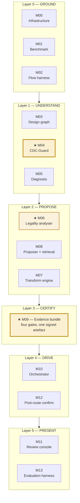
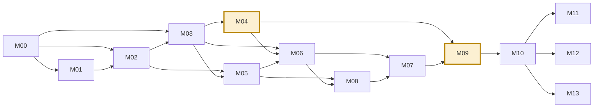
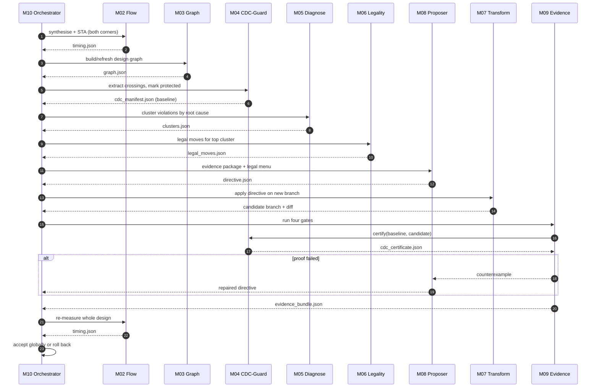
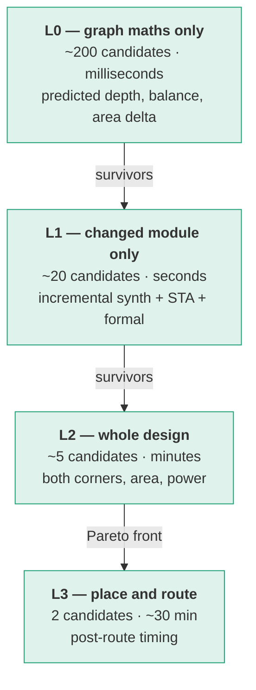
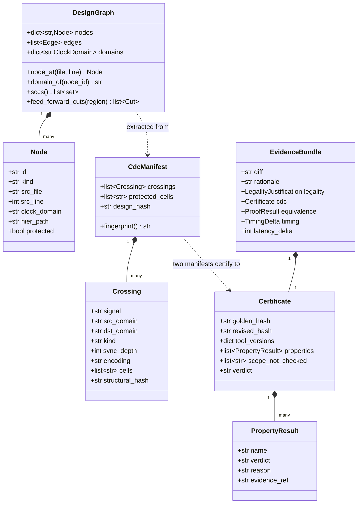

# 01 — System architecture

## The six layers

Each layer depends only on the layer beneath it. That is what lets three people build in parallel.



## Dependency graph — what actually blocks what



**Critical path:** `M00 → M02 → M03 → M04 → M09`. Everything else has slack. If M02 slips, everything slips — that is why HW-B front-loads it.

## One iteration of the loop



## The evaluation ladder

Evaluating a candidate costs anywhere from a millisecond to half an hour. Running the full flow on every idea consumes the month, so candidates pass through a funnel.



**Rule:** never run an expensive tier on something a cheap tier could have rejected.

## Core data model



## Repository layout

```
rtl-timing-agent/
├── README.md
├── Makefile                    # env, smoke, test, run, report
├── docs/
│   ├── 00-vision.md            ← read first
│   ├── 01-architecture.md      ← you are here
│   ├── 02-timeline.md
│   ├── 03-team.md
│   ├── 04-contracts.md
│   ├── 05-glossary.md
│   └── modules/M00…M13.md      ← the runbooks
├── schemas/                    # 9 JSON schemas + examples  (M00)
│   ├── timing.schema.json
│   ├── graph.schema.json
│   ├── cdc_manifest.schema.json
│   ├── cdc_certificate.schema.json
│   ├── clusters.schema.json
│   ├── legal_moves.schema.json
│   ├── directive.schema.json
│   ├── evidence_bundle.schema.json
│   ├── run_record.schema.json
│   └── examples/               # hand-written mocks — the unblocker
├── rtl/
│   ├── shell/                  # 5-domain interconnect shell   (M01)
│   ├── golden/                 # optimised reference blocks
│   └── damaged/                # generated variants + fault manifests
├── flow/
│   ├── yosys/synth.tcl         # (M02)
│   ├── sta/timing.tcl
│   ├── formal/*.eqy *.sby      # (M09)
│   └── pnr/                    # (M12)
├── src/
│   ├── cdcguard/               # ★ standalone-installable   (M04)
│   ├── flowharness/            # (M02)
│   ├── dkg/                    # (M03)
│   ├── diagnose/               # (M05)
│   ├── legality/               # (M06)
│   ├── transform/              # (M07)
│   ├── proposer/               # (M08)
│   ├── evidence/               # (M09)
│   ├── orchestrator/           # (M10)
│   ├── console/                # (M11)
│   └── evaluate/               # (M13)
├── tests/
└── runs/                       # content-addressed artefact cache
```

**`src/cdcguard/` has its own `pyproject.toml` and README from day one.** It must be `pip install`-able and runnable with zero dependency on the rest of the repo. That is the difference between demonstrating a feature and demonstrating a tool somebody could adopt on Monday.
