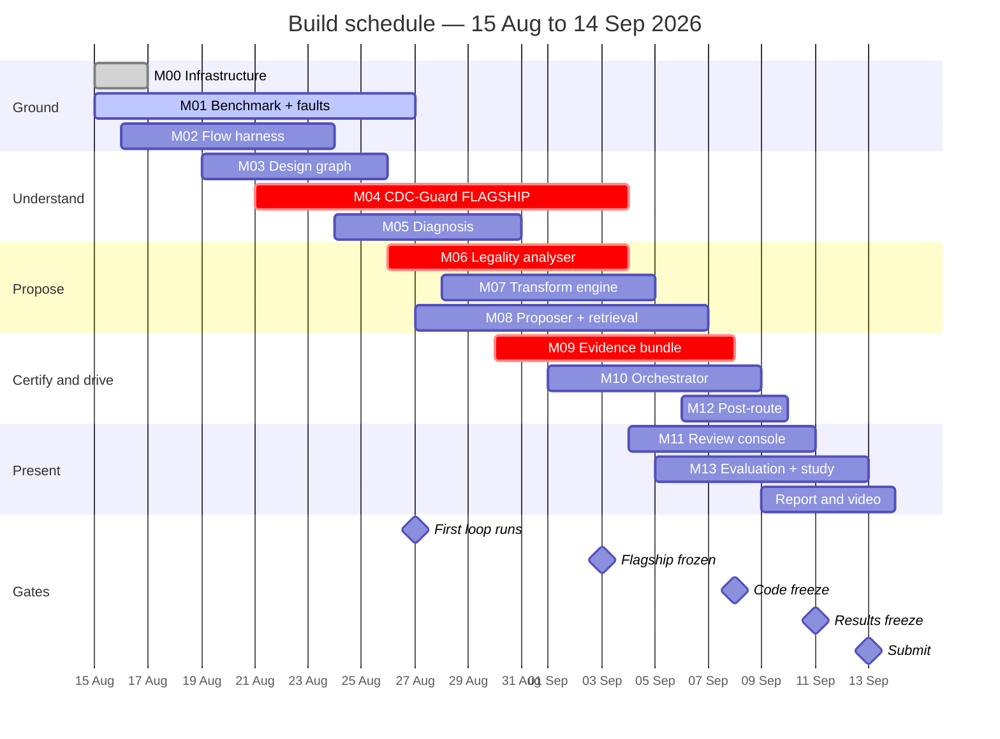
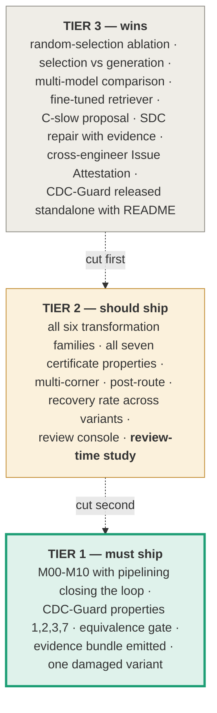

# 02 — Timeline: 15 August → 14 September 2026

31 days. Built backwards from four fixed dates.

| Milestone | Date | Day | Meaning |
|---|---|---|---|
| **First loop runs** | 27 Aug | 13 | Diagnose → propose → apply → certify → measure, unattended, once |
| **Flagship frozen** | 3 Sep | 20 | CDC-Guard rejects the gray-code rewrite. No more features in M04. |
| **Code freeze** | 8 Sep | 25 | No new features anywhere. Bug fixes only. |
| **Results freeze** | 11 Sep | 28 | Every number in the report exists and regenerates from one command. |
| **Submit** | 13 Sep | 30 | One clear day of margin before the 14th. |

## Week by week

### Week 1 — 15 to 21 Aug · Foundations
**Objective:** a real slack number out of a real design, and everyone permanently unblocked.

| Who | Deliverable by end of week |
|---|---|
| SW-1 | Docker image with pinned OSS CAD Suite; repo pushed; **all nine JSON schemas + example mocks committed** |
| HW-B | `make smoke` produces `timing.json` with real WNS/TNS from a small design; async clock groups verified on a two-clock toy |
| HW-A | Five-domain shell RTL elaborating and simulating; the two-clock CDC test case that M04 will use every day |

**Exit test:** any team member clones the repo, runs one command, gets a byte-identical result.

### Week 2 — 22 to 28 Aug · Understanding
**Objective:** point at a violation, name its cause and its RTL line; list every crossing in the design.

| Who | Deliverable |
|---|---|
| HW-A | M04 **extract** mode working: every crossing in the benchmark correctly found and classified |
| HW-B | M03 graph with netlist→RTL line mapping; M05 clustering hundreds of paths into <10 causes |
| SW-1 | M08 evidence-package assembly against mocked inputs; orchestrator skeleton |

**Day 13 (27 Aug) is integration day one.** Nobody writes new features. The whole loop runs end to end, however crudely.

### Week 3 — 29 Aug to 4 Sep · Flagship and autonomy
**Objective:** CDC-Guard certifies; the loop accepts a transformation without a human.

| Who | Deliverable |
|---|---|
| HW-A | M04 **certify** mode + all seven properties; **the gray-code rewrite is rejected on video** |
| HW-B | M07 pipelining + retiming + replication applying from directives |
| SW-1 | M08 selection mode returning valid directives; M10 tiered evaluation ladder |

**Day 20 (3 Sep): flagship frozen.** After this date M04 takes bug fixes only.

### Week 4 — 5 to 11 Sep · Evidence and measurement
**Objective:** nothing is accepted without a certificate; every number exists.

| Who | Deliverable |
|---|---|
| HW-A | M13 evaluation sweep + **the review-time study run with real participants** |
| HW-B | M12 post-route on representative blocks; console polish absorbed from SW-1 |
| SW-1 | M09/M10 complete; M11 review console rendering evidence bundles |

**Day 25 (8 Sep): code freeze. Day 28 (11 Sep): results freeze.**

### Week 5 — 12 to 14 Sep · Delivery
Report drafted from the skeleton started on day 20. Video recorded twice — a rehearsal on day 26 that reveals what is broken, and the real take on day 29. **Submit on 13 September.**

## The de-scoping ladder

We will fall behind somewhere. Decide now, not in a panic on 10 September. Cut strictly from the bottom.

> **The cutting rule.** Protect CDC-Guard first, the evidence bundle second, the optimiser third.
> A working certificate with a modest optimiser beats an impressive optimiser with no certificate,
> because the certificate is the part nobody else has and the part a company could actually use.
>
> And: **one transformation family working end to end with proofs beats six half-built.**
> If day 20 arrives and pipelining is not closing the loop, stop adding families.
