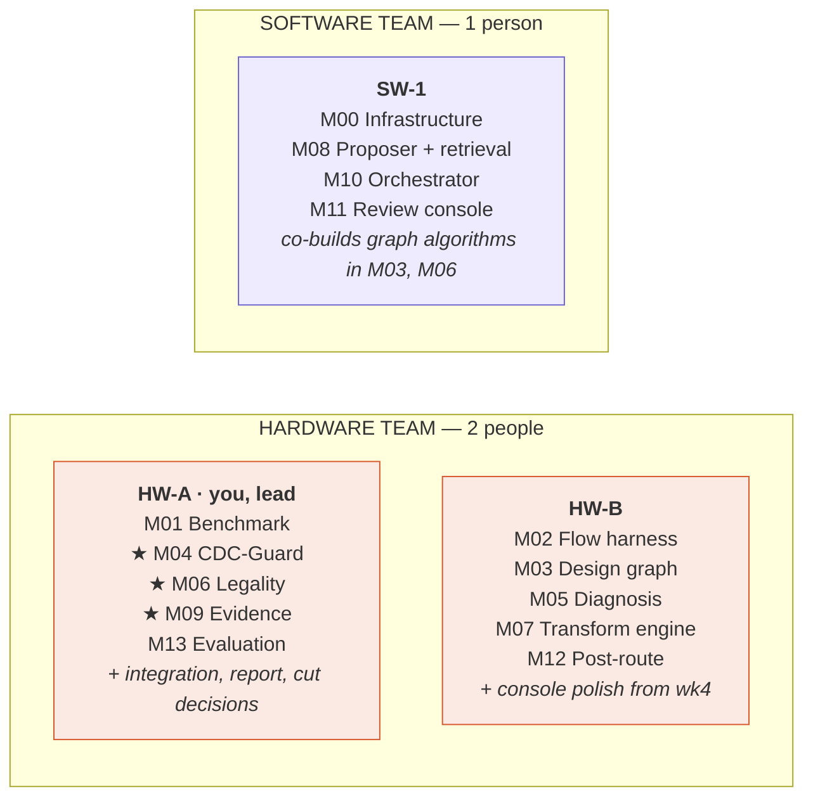

# 03 — Who builds what

Two teams, three people, one hard constraint: **the software team is one person and cannot absorb overflow.** Hardware absorbs it instead. Plan for that from the start rather than discovering it in week three.

## HW-A — you

**Own:** M01, M04 ★, M06 ★, M09 ★, M13. **Also own:** integration, the report, and the decision on what gets cut.

This allocation is deliberate. As lead you hold the modules carrying the differentiator, because you are the person who has to defend them under questioning. You also need to understand the benchmark deeply enough to design the traps in it.

**Your heaviest stretch is days 6–20**, when CDC-Guard and the legality analyser overlap. Protect that window: no meetings, no tool debugging, no report writing before day 20.

**What you should personally be able to explain without notes by day 10:** why a gray code makes a bus crossing safe, why rewriting it as binary-plus-converter passes equivalence and breaks silicon, and why a register cannot go inside a feedback loop.

## HW-B

**Own:** M02, M03 (with SW-1), M05, M07, M12.

You are on the critical path in week one — nothing else can start until synthesis and STA produce machine-readable output. **Front-load hard: M02 works by day 5 even if it is ugly.** Refactor later; unblock now.

From week 4 you absorb console polish and evaluation plumbing so SW-1 stays on the orchestrator.

## SW-1 — the scarcest resource

**Own:** M00, M08, M10, M11. **Co-build:** the graph algorithms inside M03 and M06.

Two things to protect this person from:

1. **Tool debugging.** When Yosys or OpenSTA misbehaves, that is hardware's problem. Hand it back.
2. **The prompt-engineering trap.** The interesting and load-bearing work in this portfolio is the graph algorithms in M06, the search control and caching in M10, and the evidence rendering in M11. The proposer is a thin layer over a well-structured evidence package.

> **A useful diagnostic:** if the model appears to be doing something clever, the legality analyser is probably underbuilt. In a healthy version of this system the model's job looks almost boring — *"pick option 3 of 5, here is why."* That is the design working as intended.

## Working agreements

- **Contracts before code.** The nine JSON schemas are agreed on day 2 and changed only by explicit announcement in the group. Anyone blocked writes a mock file and continues.
- **Fifteen minutes daily, standing up.** What landed, what is blocked, what interface changed. Nothing longer.
- **Two immovable integration days: day 13 and day 25.** Nobody writes new features; the whole system runs end to end.
- **Every number is reproducible from one command.** If it cannot be regenerated, it does not go in the report.
- **The founder does not become a bottleneck.** If you are the only person who can answer a question, write the answer down once rather than answering it three times.

## The first 48 hours

| Who | Day 1 (15 Aug) | Day 2 (16 Aug) |
|---|---|---|
| **HW-A** | Sketch the benchmark on paper: five domains, where elastic buffers go, where the sideband crosses. Decide which gray pointer becomes the trap. | Write the smallest two-clock design with one synchroniser and one gray pointer. Confirm it simulates. **This becomes M04's first test case and you will use it every day for a month.** |
| **HW-B** | Get Yosys + OpenSTA running on a 20-line module with a free standard cell library. Obtain **one real slack number.** | Wrap it in a script emitting `timing.json`. Ugly is fine. Then verify `set_clock_groups -asynchronous` makes the meaningless cross-domain paths disappear on a two-clock toy. |
| **SW-1** | Install OSS CAD Suite, build the Docker image, push the repo skeleton. | Write all nine JSON schemas with hand-populated examples. Announce them. **This is the moment the other two become permanently unblockable.** |

> The single most valuable thing to achieve in the first 48 hours is **one real slack number** out of one real design through the open tool flow, and **one hand-written two-clock design with a synchroniser in it.** Everything else is planning. Those two artefacts are where this project stops being a document and starts being a system.
