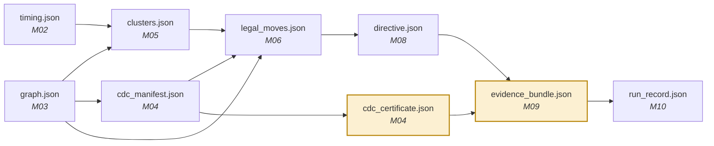

# 04 — Interface contracts

> **Day-2 deliverable, non-negotiable.** Nine schemas plus one hand-populated example each, committed and announced. From that moment all three of us are permanently unblockable.

## Why this is the highest-leverage decision in the plan

Every module reads and writes plain JSON files on disk. **No module calls another module's functions.** This looks like bureaucracy. It is not.

1. Any module can be replaced without touching the others.
2. Anyone blocked on a module that does not exist writes a mock file and keeps working.
3. Every intermediate state is inspectable when something goes wrong at 2am on 12 September.



## The nine

| Schema | Produced by | Consumed by | Carries |
|---|---|---|---|
| `timing.json` | M02 | M05, M09, M10 | WNS/TNS per corner, Fmax, area, power, per-path **cell vs net delay split** |
| `graph.json` | M03 | M04, M05, M06 | nodes ↔ source lines ↔ clock domains ↔ hierarchy |
| `cdc_manifest.json` | M04 | M06, M09 | every crossing, its kind, `driven_directly_by_flops`, structural hash |
| `cdc_certificate.json` | M04 | M09, M11 | ★ the seven properties, `scope_not_checked`, verdict |
| `clusters.json` | M05 | M06, M08 | ranked root causes with diagnosis and RTL region |
| `legal_moves.json` | M06 | M07, M08 | the finite menu, iteration bound, legality proofs |
| `directive.json` | M08 | M07 | the model's **choice**, with rationale |
| `evidence_bundle.json` | M09 | M10, M11 | ★ the product surface |
| `run_record.json` | M10 | M13 | full provenance: seeds, versions, every iteration |

## Three fields that are mandatory everywhere

| Field | Why | Trust property |
|---|---|---|
| `tool_versions` | A number without its tool version is not evidence | provenance |
| `design_hash` | Proves the artefact covers *this* design, not a stale one | provenance |
| `scope_not_checked` | States what we did **not** verify | bounded scope |

And one rule about verdicts:

> **`unproven` is a first-class result and must never be reported as `pass`.**
> A certificate saying PASS when a proof timed out is worse than no certificate — it destroys trust permanently, and trust is the only thing we are actually selling.

## Enforcement

```python
# src/common/contracts.py — every module imports this
import json, pathlib, jsonschema
SCHEMAS = pathlib.Path(__file__).parents[2] / "schemas"

def validate(obj: dict, name: str) -> dict:
    schema = json.loads((SCHEMAS / f"{name}.schema.json").read_text())
    jsonschema.validate(obj, schema)     # raises — fail loud, fail early
    return obj

def write(obj: dict, path: str, name: str) -> None:
    validate(obj, name)
    pathlib.Path(path).write_text(json.dumps(obj, indent=2, sort_keys=True))
```

> **No module writes an artefact without validating it first.** A contract that is not enforced is a suggestion.

## Changing a contract

1. Announce in the group chat **before** changing anything.
2. Bump the `version` field.
3. Update the example file in `schemas/examples/`.
4. Everyone re-runs `make test`.

Silent contract changes are the fastest way to lose a day of three people's time.
