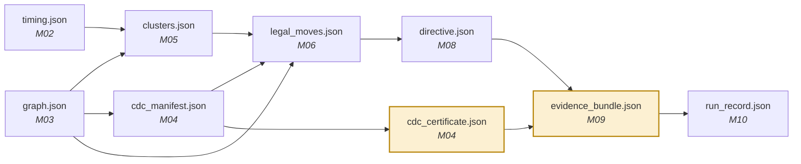

# M00 — Infrastructure and contracts

> The least interesting module, and the one that silently decides whether the other thirteen can be built in parallel.

| | |
|---|---|
| **Owner** | SW-1 |
| **Days** | 2 (15–16 Aug) |
| **Tier** | 1 |
| **Depends on** | nothing |
| **Blocks** | everything |

## 1. What it does

The repository, a pinned tool environment inside a container, the nine JSON schemas with hand-written example files, and a test runner.

## 2. Why it matters more than it sounds

The open EDA tools are version-sensitive in ways that will cost you days:

- The logic optimiser inside Yosys (ABC) produces different results depending on its version **and the order of its options**.
- Physical placement is seeded.
- Different Liberty libraries give different absolute numbers for the same design.

Without pinning, somebody will spend an evening convinced a transformation improved timing when in reality the seed changed. **Determinism is one of the six trust properties** ([vision §2](../00-vision.md)) — every number we report must survive the question *"can you reproduce that?"*

## 3. Build steps

```bash
# 1. Get the toolchain. ONE download. Do NOT compile from source — it costs a day.
wget https://github.com/YosysHQ/oss-cad-suite-build/releases/download/<PINNED>/oss-cad-suite-linux-x64-<DATE>.tgz
tar xzf oss-cad-suite-*.tgz
source oss-cad-suite/environment

# 2. Confirm every tool is present and record its version
for t in yosys sta sby eqy verilator; do echo -n "$t: "; $t -V 2>&1 | head -1; done
```

```dockerfile
# Dockerfile — pin everything
FROM ubuntu:24.04
ARG OSS_CAD_DATE=2026-07-01          # PINNED. Never "latest".
RUN apt-get update && apt-get install -y --no-install-recommends \
        python3.11 python3-pip git make wget ca-certificates \
    && rm -rf /var/lib/apt/lists/*
RUN wget -qO /tmp/oss.tgz \
      https://github.com/YosysHQ/oss-cad-suite-build/releases/download/${OSS_CAD_DATE}/oss-cad-suite-linux-x64-${OSS_CAD_DATE//-/}.tgz \
    && tar xzf /tmp/oss.tgz -C /opt && rm /tmp/oss.tgz
ENV PATH="/opt/oss-cad-suite/bin:${PATH}"
COPY requirements.txt /tmp/
RUN pip3 install --break-system-packages -r /tmp/requirements.txt
ENV PYTHONHASHSEED=0 RTLAGENT_SEED=1337
WORKDIR /work
```

## 4. The version stamp — copy this verbatim

Every artefact the system writes carries this. It is the provenance property made mechanical.

```python
# src/common/provenance.py
import hashlib, json, subprocess, os, pathlib, datetime

def tool_versions() -> dict:
    """Record every tool that could change a number. Cached per process."""
    out = {}
    for name, cmd in [("yosys", ["yosys", "-V"]),
                      ("opensta", ["sta", "-version"]),
                      ("symbiyosys", ["sby", "--version"]),
                      ("eqy", ["eqy", "--version"]),
                      ("verilator", ["verilator", "--version"])]:
        try:
            out[name] = subprocess.run(cmd, capture_output=True, text=True,
                                       timeout=15).stdout.strip().splitlines()[0]
        except Exception as e:
            out[name] = f"UNAVAILABLE: {e}"
    out["seed"] = os.environ.get("RTLAGENT_SEED", "unset")
    out["liberty"] = os.environ.get("RTLAGENT_LIBERTY", "unset")
    return out

def design_hash(rtl_dir: str) -> str:
    """sha256 over sorted file contents. Two identical designs hash identically
    regardless of mtime or path."""
    h = hashlib.sha256()
    for p in sorted(pathlib.Path(rtl_dir).rglob("*.[sv]v")):
        h.update(p.name.encode())
        h.update(p.read_bytes())
    return h.hexdigest()

def stamp(obj: dict, rtl_dir: str | None = None) -> dict:
    obj["tool_versions"] = tool_versions()
    obj["generated_at"] = datetime.datetime.now(datetime.UTC).isoformat()
    if rtl_dir:
        obj["design_hash"] = design_hash(rtl_dir)
    return obj
```

## 5. The nine schemas — the day-2 unblocker

Write all nine **plus one hand-populated example each**, then announce them in the group chat. From that moment anyone blocked on a module that does not exist writes a mock and keeps moving.



Validation helper every module imports:

```python
# src/common/contracts.py
import json, pathlib, jsonschema
SCHEMAS = pathlib.Path(__file__).parents[2] / "schemas"

def validate(obj: dict, schema_name: str) -> dict:
    schema = json.loads((SCHEMAS / f"{schema_name}.schema.json").read_text())
    jsonschema.validate(obj, schema)     # raises on mismatch — fail loud, fail early
    return obj

def write(obj: dict, path: str, schema_name: str):
    validate(obj, schema_name)
    pathlib.Path(path).write_text(json.dumps(obj, indent=2, sort_keys=True))
```

> **Rule:** no module writes an artefact without validating it first. A contract that is not enforced is a suggestion.

## 6. Makefile

```makefile
.PHONY: env smoke test run report clean
IMAGE := rtl-agent:pinned

env:                      ## build the pinned container
	docker build -t $(IMAGE) .

smoke:                    ## 20-line design -> real slack number. MUST pass day 1.
	docker run --rm -v $$PWD:/work $(IMAGE) python3 -m flowharness.smoke

test:
	docker run --rm -v $$PWD:/work $(IMAGE) pytest -q tests/

run:                      ## full optimisation loop on the damaged benchmark
	docker run --rm -v $$PWD:/work $(IMAGE) python3 -m orchestrator.run \
	    --rtl rtl/damaged/v1 --sdc rtl/shell/constraints.sdc --budget 20

report:                   ## regenerate EVERY number and figure in the paper
	docker run --rm -v $$PWD:/work $(IMAGE) python3 -m evaluate.all
```

## 7. Definition of done

- [ ] Any team member clones, runs `make env && make smoke`, gets a **byte-identical** result
- [ ] All nine schemas exist, parse, and have an example that validates against them
- [ ] `tool_versions()` returns real versions for all five tools
- [ ] `make test` runs and passes (even if only trivially at first)
- [ ] Seeds pinned in the environment and echoed into every artefact

## 8. Failure modes

| Symptom | Cause | Fix |
|---|---|---|
| "works on my machine" | Someone bypassed the container | All commands go through `make`. No exceptions. |
| Numbers drift between runs | Seed or version unpinned | Diff the `tool_versions` block of the two run records — it will tell you which |
| Schema churn blocks people | Changing a contract without announcing | Contract changes are announced in the group chat and versioned. Never silent. |
