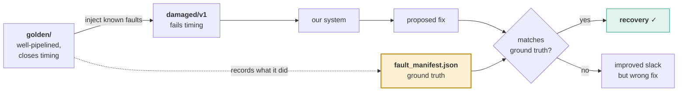
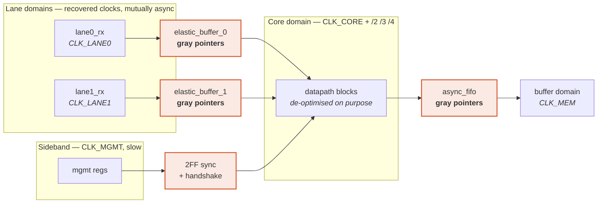

# M01 — Benchmark and fault injector

> The design our system operates on, plus a generator that produces broken versions of it on demand.

| | |
|---|---|
| **Owner** | HW-A (you) |
| **Days** | 6 (15–26 Aug, overlapping) |
| **Tier** | 1 |
| **Depends on** | M00 |
| **Blocks** | M02, M04 |

## 1. Two decisions that make this strategic rather than routine

### Decision one — build it backwards

The instinct is to grab a mature open-source core. **Do not.** Two reasons:

1. Mature cores are already timing-closed by their authors. Our optimiser will find nothing to fix.
2. Worse: there is no way to tell whether a proposed fix was the **correct** one or merely one that happened to improve slack.

Instead, start from a well-optimised reference and apply **known de-optimisations**. We then know the correct fix for every injected fault, because we injected it.



> This converts our headline metric from *"did slack improve"* to *"did the system recover the known-correct transformation."*
> Almost nothing in the published literature can measure that.

It also turns one benchmark into a **generator**: parameterise the faults and produce dozens of variants, so we report pass rates instead of anecdotes.

### Decision two — make it look like their product

The required shell is five async masters, generated clocks, multi-ratio dividers, CDC. Arrange them the way a **multi-lane link device** arranges them.



Coral = protected CDC structures, never touched by the optimiser. Five independent masters: `CLK_LANE0`, `CLK_LANE1`, `CLK_CORE`, `CLK_MEM`, `CLK_MGMT`.

**Include an odd divide ratio.** Divide-by-3 at 50% duty requires both clock edges and is a classic source of subtle constraint bugs. Getting it right costs almost nothing and demonstrates competence.

## 2. The trap — plant it deliberately on day 3

One gray-coded pointer should be written so it **looks like redundant, optimisable logic**. When the optimiser tries to rewrite it, formal equivalence passes and CDC-Guard rejects it.

```verilog
// rtl/shell/elastic_buffer.v  — the trap, planted on purpose
// Written so an optimiser sees "wasteful" gray arithmetic and wants to
// replace it with a binary counter + converter. That rewrite is EQUIVALENT
// and UNSAFE. CDC-Guard property 3 catches it. This is the demo.

module gray_counter #(parameter W = 4) (
    input                  clk,
    input                  rst_n,
    input                  inc,
    output reg [W-1:0]     gray_q      // MUST come straight out of these flops
);
    // deliberately NOT: binary counter + bin2gray combinational converter
    reg [W-1:0] bin_q;
    wire [W-1:0] bin_next  = bin_q + {{(W-1){1'b0}}, inc};
    wire [W-1:0] gray_next = bin_next ^ (bin_next >> 1);

    always @(posedge clk or negedge rst_n) begin
        if (!rst_n) begin
            bin_q  <= '0;
            gray_q <= '0;
        end else begin
            bin_q  <= bin_next;
            gray_q <= gray_next;   // registered ⇒ driven_directly_by_flops = TRUE
        end
    end
endmodule
```

## 3. The fault injector

```python
# src/benchmark/inject.py
"""Apply KNOWN de-optimisations. Every fault records the correct fix."""
from dataclasses import dataclass, asdict

@dataclass
class Fault:
    fault_id: str
    kind: str            # flatten_pipeline | ripple_adder | deep_fsm_decode |
                         # widen_multiplier | priority_cascade | fanout_bomb
    module: str
    src_file: str
    line_start: int
    line_end: int
    correct_fix: dict    # THE GROUND TRUTH: {"kind":"pipeline_cut","cut_after":"mult_stage","latency_delta":1}
    severity: int        # 1..5, tunes how hard the benchmark is

FAULTS = {
  "flatten_pipeline":  "merge N pipeline stages into one combinational blob",
  "ripple_adder":      "replace a balanced/carry-select adder with ripple carry",
  "deep_fsm_decode":   "re-encode one-hot FSM as deep binary decode",
  "widen_multiplier":  "replace pipelined multiplier with single-cycle wide multiply",
  "priority_cascade":  "rewrite a balanced mux tree as a long if/else-if chain",
  "fanout_bomb":       "collapse a replicated driver into one high-fanout net",
}

def inject(golden_dir, out_dir, faults: list[Fault], seed: int):
    """Apply faults, write damaged RTL + fault_manifest.json (ground truth)."""
    ...
```

**Rule: every fault type must have a matching entry in M06's legal move set.** Otherwise the system cannot possibly recover it, and the recovery-rate metric is meaningless.

| Fault | Correct fix | M06 move kind |
|---|---|---|
| `flatten_pipeline` | re-insert the stage at the same cut | `pipeline_cut` |
| `ripple_adder` | substitute carry-select / CLA | `arith_substitute` |
| `deep_fsm_decode` | re-encode to one-hot | `fsm_reencode` |
| `widen_multiplier` | pipeline the multiply | `pipeline_cut` |
| `priority_cascade` | rebuild as balanced tree | `restructure_tree` |
| `fanout_bomb` | replicate the driver | `replicate_driver` |

## 4. Build order

| Day | Deliverable |
|---|---|
| 1 | Paper sketch: five domains, where buffers go, where the sideband crosses. Decide the trap. |
| 2 | Smallest two-clock design with one synchroniser + one gray pointer. Simulates. **M04's first fixture.** |
| 3 | Full shell: clock gen, dividers (÷2 ÷3 ÷4), elastic buffers, async FIFO, 2FF sync + handshake |
| 4 | Datapath blocks, well-pipelined. Golden closes timing at target. |
| 5 | Fault injector with three fault kinds; generate `damaged/v1` |
| 6 | All six fault kinds; ~50K cells confirmed; cocotb regression passing on golden |

## 5. Definition of done

- [ ] Golden simulates correctly and closes timing at the target period
- [ ] Damaged variant fails timing; `fault_manifest.json` describes the difference exactly
- [ ] Five independent masters, ≥1 generated clock each, dividers at 2/3/4
- [ ] ≥14 CDC structures including 2 elastic buffers, 1 async FIFO, 1 handshake, the trap
- [ ] Cell count in the 40–60K range after synthesis
- [ ] `make damaged SEED=n` regenerates variants reproducibly
- [ ] **Licensing checked** on anything adapted from open sources

## 6. Failure modes

| Symptom | Cause | Fix |
|---|---|---|
| System fixes everything in 2 iterations | Faults too mild | Raise `severity`; the injector is parameterised for exactly this |
| System fixes nothing in 20 | Faults too deep, or no matching legal move | Check the fault↔move table above |
| Cell count far off 50K | Datapath too small/large | Replicate lanes or widen datapaths; do not redesign |
| Golden does not close timing | SDC wrong, likely async groups | Fix constraints before blaming RTL — see M02 §"three things easy to get wrong" |
