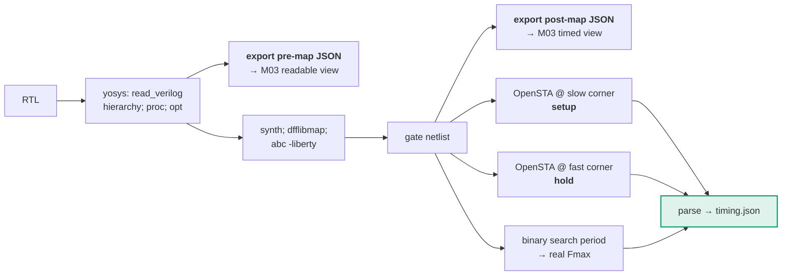

# M02 — Flow harness: synthesis and static timing analysis

> The scripted pipeline that turns RTL into numbers. **You are on the critical path in week one — nothing else can start until this produces machine-readable output.**

| | |
|---|---|
| **Owner** | HW-B |
| **Days** | 5 (16–23 Aug) |
| **Tier** | 1 |
| **Depends on** | M00, M01 |
| **Blocks** | M03, M05, and therefore everything |

## 1. Concepts, for anyone coming from FPGA work

In an FPGA flow the silicon is fixed and the vendor supplies timing data. In ASIC you choose:

- a **standard cell library** — a collection of pre-characterised logic gates
- a **Liberty (.lib) file** — gives each gate's delay as a function of input slew and output load

You supply that file to **both** synthesis and timing analysis. Sky130 and Nangate45 are free and adequate.

| Tool | Reads | Writes | Vivado analogue |
|---|---|---|---|
| **Yosys** | Verilog + Liberty | gate netlist | `synth_design` |
| **OpenSTA** | netlist + Liberty + SDC | slack on every path | `report_timing_summary` |

## 2. Flow



## 3. Three things easy to get wrong and expensive to discover late

### 3.1 Asynchronous clock groups — one line makes the benchmark tractable

Without this, OpenSTA times paths between unrelated clocks and reports thousands of meaningless violations. Your critical-path list becomes pure noise.

```tcl
# flow/sta/constraints_clocks.sdc
create_clock -name CLK_LANE0 -period 2.500 [get_ports clk_lane0]
create_clock -name CLK_LANE1 -period 2.500 [get_ports clk_lane1]
create_clock -name CLK_CORE  -period 2.000 [get_ports clk_core]
create_clock -name CLK_MEM   -period 3.000 [get_ports clk_mem]
create_clock -name CLK_MGMT  -period 20.00 [get_ports clk_mgmt]

# generated clocks — one per master, multiple ratios incl. an odd one
create_generated_clock -name CORE_DIV2 -source [get_ports clk_core] \
    -divide_by 2 [get_pins clkdiv_core/div2_q]
create_generated_clock -name CORE_DIV3 -source [get_ports clk_core] \
    -divide_by 3 [get_pins clkdiv_core/div3_q]
create_generated_clock -name CORE_DIV4 -source [get_ports clk_core] \
    -divide_by 4 [get_pins clkdiv_core/div4_q]

# ***** THE LINE THAT MAKES THIS BENCHMARK TRACTABLE *****
# Without it: thousands of meaningless cross-domain violations.
set_clock_groups -asynchronous \
    -group {CLK_LANE0} \
    -group {CLK_LANE1} \
    -group {CLK_CORE CORE_DIV2 CORE_DIV3 CORE_DIV4} \
    -group {CLK_MEM} \
    -group {CLK_MGMT}
```

> Note the grouping: `CLK_CORE` and its generated clocks are in **one** group because they are synchronous to each other. Getting this wrong in either direction (too many groups, too few) breaks the analysis. **M04 reads the same grouping** to decide which crossings are real.

### 3.2 Both corners — setup at slow, hold at fast

Reporting only setup at a typical corner is reporting half the truth, and any experienced reviewer notices immediately. **Retiming and pipelining create hold violations.** Cost: one extra invocation.

### 3.3 Frequency, not slack

A design at −0.01 ns and one at −0.9 ns look similarly failing if you quote slack. Binary-search the clock period:

```python
def find_fmax(rtl, sdc, lo_ns=0.5, hi_ns=20.0, tol=0.01):
    """Real Fmax, not slack at one arbitrary target."""
    while hi_ns - lo_ns > tol:
        mid = (lo_ns + hi_ns) / 2
        if run_sta(rtl, sdc, period=mid).wns_ns >= 0:
            hi_ns = mid          # met timing, try faster
        else:
            lo_ns = mid          # failed, back off
    return 1000.0 / hi_ns        # MHz
```

## 4. Scripts

```tcl
# flow/yosys/synth.tcl
yosys -import
foreach f [glob $::env(RTL_DIR)/*.v] { read_verilog -sv $f }
hierarchy -check -top $::env(TOP)

# pre-map export FIRST — readable, traceable, keeps src attributes.
# After abc, cell names are mangled and structure is unrecognisable.
proc; opt; fsm; opt; memory; opt
write_json $::env(OUT_DIR)/premap.json

# keep hierarchy so equivalence checking can match state elements later
synth -top $::env(TOP) -flatten
dfflibmap -liberty $::env(LIBERTY)
abc -liberty $::env(LIBERTY) -D $::env(TARGET_PS)
opt_clean

# do NOT let opt_merge eat the synchronisers — M04 supplies this file
source $::env(OUT_DIR)/keep_attrs.tcl

write_verilog -noattr $::env(OUT_DIR)/netlist.v
write_json $::env(OUT_DIR)/postmap.json
stat -liberty $::env(LIBERTY)
```

```tcl
# flow/sta/timing.tcl
read_liberty $::env(LIBERTY)
read_verilog $::env(OUT_DIR)/netlist.v
link_design $::env(TOP)
read_sdc     $::env(SDC)

report_checks -path_delay $::env(CHECK) -group_count 200 \
              -slack_max 0 -format full_clock_expanded \
              -fields {slew cap input_pins nets fanout} \
              > $::env(OUT_DIR)/checks_$::env(CHECK).rpt
report_wns  > $::env(OUT_DIR)/wns_$::env(CHECK).rpt
report_tns  > $::env(OUT_DIR)/tns_$::env(CHECK).rpt
report_power > $::env(OUT_DIR)/power.rpt
```

## 5. The parser — extract the delay split

```python
# src/flowharness/parse_sta.py
CELL_RE = re.compile(r'^\s+([\d.]+)\s+([\d.]+)\s+([\d.]+)\s+\S*\s+(\S+)\s+\((\S+)\)')

def parse_path(block: str) -> dict:
    cells, cell_delay, net_delay = [], 0.0, 0.0
    for line in block.splitlines():
        m = CELL_RE.match(line)
        if not m: continue
        incr, _, _, pin, ref = m.groups()
        # OpenSTA alternates net delay / cell delay rows
        if ref.startswith("net"): net_delay  += float(incr)
        else:                     cell_delay += float(incr)
        cells.append({"id": pin, "ref": ref, "delay_ns": float(incr)})
    return {"cells": cells,
            "cell_delay_ns": cell_delay,
            "net_delay_ns":  net_delay}     # ← M05 needs this split
```

> **Why the split matters:** if net delay dominates, the bottleneck is routing/fanout and **pipelining will not help** — the correct fix is driver replication. Published measurements on real cores found interconnect at roughly two thirds of critical-path delay. A classifier ignoring this proposes the wrong transformation confidently.

## 6. Build order

| Day | Deliverable |
|---|---|
| 1 | **One real slack number** from a 20-line module. Nothing else matters today. |
| 2 | `timing.json` emitted and schema-valid; async clock groups verified on a two-clock toy |
| 3 | Both corners; power and area extracted |
| 4 | Fmax binary search; pre-map and post-map JSON export for M03 |
| 5 | Incremental re-synthesis of a single module; caching by input hash |

## 7. Definition of done

- [ ] One command: RTL + SDC → schema-valid `timing.json`, both corners, **under 2 minutes** on the full benchmark
- [ ] Async clock groups verified — cross-domain paths absent from the report
- [ ] `net_delay_ns` / `cell_delay_ns` split populated per path
- [ ] Fmax by binary search, not slack at a fixed target
- [ ] Incremental mode: changing one module does not re-synthesise the world
- [ ] Same inputs → identical outputs (seeds and versions pinned)

## 8. Failure modes

| Symptom | Cause | Fix |
|---|---|---|
| Thousands of violations across unrelated clocks | Missing `set_clock_groups -asynchronous` | §3.1 |
| Synchroniser flops vanish from the netlist | `opt_merge` collapsed them | Source `keep_attrs.tcl` from M04 **after** synth |
| Cell names meaningless in reports | Exported JSON only after `abc` | Export **pre-map** JSON too (§4) |
| Numbers drift run to run | ABC option order / seed | Pin them; diff `tool_versions` between run records |
| Div-by-3 paths look impossible | Generated clock defined from the wrong pin | Define at the divider's Q pin, not the input |
