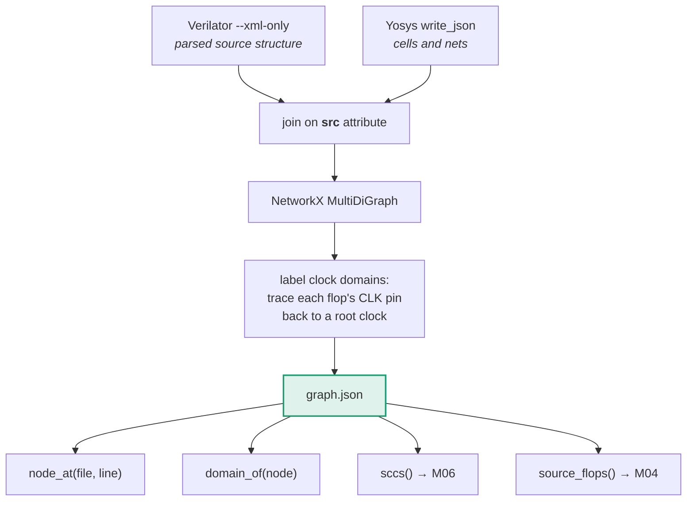

# M03 — Design knowledge graph

> One queryable structure linking source lines, gates, clock domains and hierarchy. **This is the shared representation substrate** — the thing that makes understanding-transfer possible at all.

| | |
|---|---|
| **Owner** | HW-B, with SW-1 on the graph algorithms |
| **Days** | 5 (19–25 Aug) |
| **Tier** | 1 |
| **Depends on** | M02 |
| **Blocks** | M04, M05, M06 |

## 1. Why nothing works without it

A timing report says gate `$auto$4471` is on the critical path. Useless to a human, useless to a model. What is needed is *"line 214 of lane_rx.v, inside the elastic buffer, in the lane-0 domain."*

This is the ladder from [vision §3](../00-vision.md) made explicit and queryable. Going down (RTL → netlist) is automatic. **Going back up is where engineers spend their lives.**



## 2. The nuance that costs a day if missed

**Build the graph before technology mapping.** After ABC runs, cell names are mangled and structure is unrecognisable. Keep **two views** plus a correspondence:

| View | Source | Good for | Bad for |
|---|---|---|---|
| `pre_map` | `write_json` after `proc; opt` | traceability, operators, structure, M06's dataflow graph | delays |
| `post_map` | `write_json` after `abc` | accurate delays, matching timing reports | readability |

`correspondence: {post_map_cell_id → pre_map_node_id}` is built from the shared `src` attribute.

## 3. Core code

```python
# src/dkg/build.py
import json, networkx as nx

def load_yosys_json(path, view):
    """Yosys JSON → NetworkX. Cells carry a 'src' attribute like 'lane_rx.v:214.3-219.9'."""
    doc = json.load(open(path))
    G = nx.MultiDiGraph(view=view)
    for mod_name, mod in doc["modules"].items():
        for cell_name, cell in mod["cells"].items():
            src = cell.get("attributes", {}).get("src", "")
            f, ln = parse_src(src)                 # 'lane_rx.v:214.3-219.9' → ('lane_rx.v', 214)
            G.add_node(f"{mod_name}/{cell_name}",
                       kind=classify_cell(cell["type"]),   # reg | comb | operator | memory
                       ref=cell["type"],
                       hier_path=mod_name,
                       src_file=f, src_line=ln,
                       protected=("keep" in cell.get("attributes", {})))
            for port, bits in cell["connections"].items():
                direction = cell["port_directions"].get(port, "input")
                for bit in bits:
                    if direction == "input":
                        G.add_edge(f"net:{bit}", f"{mod_name}/{cell_name}", port=port, bit=bit)
                    else:
                        G.add_edge(f"{mod_name}/{cell_name}", f"net:{bit}", port=port, bit=bit)
    return G


def label_clock_domains(G, clocks):
    """Trace each register's clock pin back to a root clock.
    A generated clock inherits its master's async_group."""
    root_of = {}
    for node, d in G.nodes(data=True):
        if d.get("kind") != "reg":
            continue
        clk_net = clock_net_of(G, node)
        root = trace_to_root_clock(G, clk_net, clocks)   # follows dividers/buffers
        d["clock_domain"] = root
        root_of[node] = root
    return root_of


def same_async_group(clocks, a, b):
    """CRITICAL for M04. CLK_CORE and CORE_DIV3 are NOT a dangerous crossing —
    they are synchronous. Two independently recovered lane clocks ARE."""
    return clocks[a]["async_group"] == clocks[b]["async_group"]
```

```python
# src/dkg/query.py — the API every downstream module uses
class DesignGraph:
    def node_at(self, file, line):        """RTL location → nodes"""
    def domain_of(self, node_id):         """node → clock domain name"""
    def registers(self):                  """all flops"""
    def predecessors_comb(self, node):    """walk back through comb logic only"""
    def sccs(self):                       """strongly connected components → M06"""
    def dataflow_view(self):              """operator-level DAG → M06 cut sets"""
```

## 4. Build order

| Day | Deliverable | Test |
|---|---|---|
| 1 | Yosys JSON → NetworkX for both views | Node count matches `stat` output |
| 2 | `src` attribute parsing, `node_at(file, line)` | Pick 10 known lines, all resolve |
| 3 | Clock domain labelling + `same_async_group` | All 5 masters + generated clocks correctly grouped |
| 4 | `correspondence` between views; Verilator AST join | Post-map cell → pre-map operator, spot-checked |
| 5 | `sccs()`, `dataflow_view()`, schema-valid export | Known accumulator appears as an SCC |

## 5. Definition of done

- [ ] Any cell from a timing report resolves to the right RTL line **and** clock domain on the full benchmark
- [ ] Both views exported; correspondence populated
- [ ] `same_async_group()` returns False for two lane clocks, True for `CLK_CORE`/`CORE_DIV3`
- [ ] `sccs()` finds every known feedback loop (test on a hand-written accumulator)
- [ ] Graph builds in under 30 s on ~50K cells

## 6. Failure modes

| Symptom | Cause | Fix |
|---|---|---|
| `src` attributes empty | Exported after `abc`, or hierarchy flattened too early | Export pre-map JSON before mapping; keep hierarchy |
| Every clock its own domain | `trace_to_root_clock` not following dividers/buffers | Follow through `$dff`, buffers and clock-gating cells to the port |
| Graph enormous and slow | Modelling every net bit as a node | Collapse buses; use `bit` as an edge attribute, not a node |
| SCCs everywhere | Using the post-map netlist where feedback is obscured | Compute SCCs on the **pre-map operator view** |
