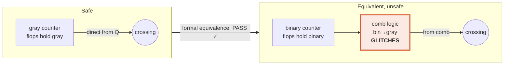
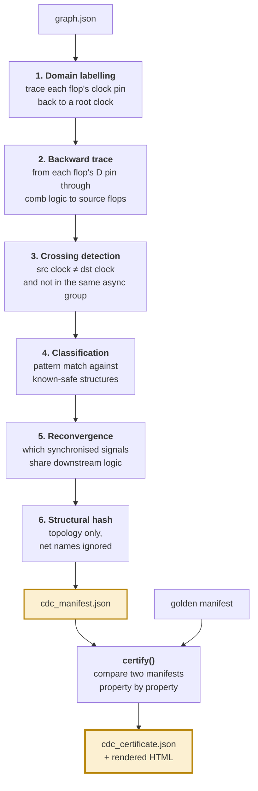
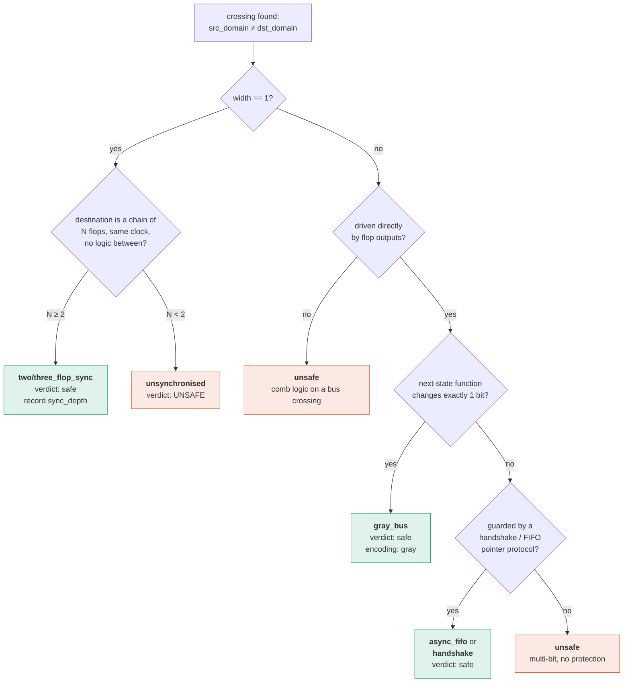

# M04 — CDC-Guard ★ FLAGSHIP

> Give it two versions of a design. It returns a signed certificate stating whether every clock-domain-crossing property that held before still holds after — and if not, exactly which one broke and where.

| | |
|---|---|
| **Owner** | HW-A (you) |
| **Days** | 9 — the largest single allocation in the project |
| **Tier** | 1 |
| **Depends on** | M03 (design graph) |
| **Blocks** | M06, M09 |
| **Frozen by** | Day 20 (3 Sep). After that, bug fixes only. |
| **Package** | `src/cdcguard/` — **must be `pip install`-able and runnable with zero dependency on the rest of the repo** |

---

## 1. What this module does

Two modes.

**`extract`** — read one design, produce a **manifest**: every place a signal crosses between clock domains, what kind of crossing it is, how it is protected, and a structural fingerprint of its topology.

**`certify`** — read two manifests, produce a **certificate**: for each of seven safety properties, did it survive the change? Pass, fail, or *unproven* — with a specific, actionable reason on failure.

```bash
$ cdcguard extract --rtl rtl/golden --out golden.manifest.json
  found 14 crossings across 5 domains
  · 8 two_flop_sync   · 4 gray_bus   · 2 async_fifo
  · 0 unsynchronised  · 1 reconvergence group
  wrote golden.manifest.json  (design_hash 4a91c7…)

$ cdcguard certify --golden golden.manifest.json --revised cand017.manifest.json
✓ PASS  crossing_set_unchanged
✓ PASS  synchroniser_topology_unchanged
✗ FAIL  gray_encoding_preserved
        rd_ptr_gray[3:0] in lane0_elastic_buffer is no longer driven directly
        by flop outputs. Driver is combinational (bin→gray) at rtl/lane_rx.v:214.
        Single-bit-transition guarantee lost; receiving domain can sample a glitch.
✓ PASS  reconvergence_unchanged
✓ PASS  fifo_protocol_unchanged
✓ PASS  reset_crossings_unchanged
? UNPR  attributes_survive_synthesis   (post-synth netlist not supplied)

  NOT CHECKED: power intent, DFT, multi-cycle path assertions, X-propagation
  VERDICT: blocked
exit 1
```

---

## 2. Why it exists — the failure no equivalence checker can see

Read [`docs/00-vision.md` §4](../00-vision.md) if you have not. The short version:

A **gray code** is an encoding where consecutive values differ in exactly one bit. That property is *why* every async FIFO uses gray-coded pointers: a receiver on an unrelated clock either catches the old value or the new one. There is no corrupt intermediate because there is no intermediate.

Rewrite a gray counter as `binary counter → bin2gray converter`. The output sequence is **bit-for-bit identical**. Formal equivalence proves them equal and approves the change.

But the gray value now emerges from **combinational logic**, and combinational logic glitches — as binary bits arrive at slightly different times the converter output flickers through values it should never produce. The receiver can catch one.



> **The single boolean that catches this: `driven_directly_by_flops`.**
> If a crossing bus was driven straight out of registers before and is driven by combinational logic after, the change is unsafe regardless of what equivalence says. Implement this on day 1 of M04 — it is 30 lines and it is the demo.

**Second threat, unrelated to AI:** Yosys's `opt_merge` will collapse the two identical flops of a synchroniser because by every metric it understands they are redundant. Property 7 catches this.

---

## 3. Concepts you need (zero background)

| Term | What it means | Why the module cares |
|---|---|---|
| **Clock domain** | Set of flops driven by the same clock (or clocks with a fixed phase relationship) | Crossings are defined between domains |
| **Asynchronous** | Two clocks with no fixed phase relationship | Only async crossings are dangerous |
| **Setup/hold window** | Short interval around a clock edge where the input must be stable | Violating it causes metastability |
| **Metastability** | Flop output hovering between 0 and 1 for an unbounded time | The hazard being defended against |
| **Synchroniser** | 2–3 flops in series on the destination clock | Gives the first flop time to settle |
| **MTBF** | Mean time between synchronisation failures | The *physical* property no equivalence checker models |
| **Gray code** | Encoding where consecutive values differ in exactly one bit | Makes multi-bit crossings safe |
| **Reconvergence** | Two separately synchronised signals recombining downstream | Can glitch even when each crossing is individually correct |
| **RDC** | Reset domain crossing — same hazard, on reset nets | Property 6 |

---

## 4. Interface contract

**Reads:** `graph.json` (M03) for one or two design versions. Optionally a post-synthesis netlist for property 7.
**Writes:** `cdc_manifest.json` per version; `cdc_certificate.json` per pair; a `keep`-attribute file for M02 to feed into synthesis.

Schemas: [`schemas/cdc_manifest.schema.json`](../../schemas/cdc_manifest.schema.json), [`schemas/cdc_certificate.schema.json`](../../schemas/cdc_certificate.schema.json).

Two fields are **mandatory and non-negotiable** in every certificate:

- `scope_not_checked` — the explicit list of what this certificate does *not* cover. Bounded scope is a trust property (see vision §2). Silent over-claim destroys trust permanently.
- `verdict: unproven` must be a first-class result, distinct from `pass`. **Never report unproven as pass.** A certificate that says PASS when a proof timed out is worse than no certificate.

---

## 5. Architecture



### Classification decision tree



---

## 6. Algorithm

### 6.1 Backward trace — the core primitive

```
FUNCTION source_flops(graph, flop):
    # walk backwards from this flop's data input, through combinational
    # logic only, stopping at the first registers encountered
    frontier = graph.data_inputs(flop)
    seen     = {}
    sources  = {}
    comb_on_path = FALSE

    WHILE frontier not empty:
        n = frontier.pop()
        IF n in seen: CONTINUE
        seen.add(n)

        IF n.kind == "reg":
            sources.add(n)                 # stop here; do not traverse through
        ELSE IF n.kind in {"comb","operator"}:
            comb_on_path = TRUE
            frontier.extend(graph.predecessors(n))
        ELSE IF n.kind == "port":
            sources.add(PRIMARY_INPUT)     # treat as its own domain
    RETURN sources, comb_on_path
```

> `comb_on_path` is what becomes `driven_directly_by_flops = NOT comb_on_path`.
> **That one boolean is 80% of the flagship's demo value.**

### 6.2 Crossing detection

```
FUNCTION extract_crossings(graph):
    crossings = []
    FOR flop IN graph.registers():
        dst = graph.domain_of(flop)
        srcs, comb = source_flops(graph, flop)
        FOR s IN srcs:
            src = graph.domain_of(s)
            IF src == dst: CONTINUE
            IF same_async_group(graph, src, dst): CONTINUE   # synchronous pair
            crossings.append(Crossing(
                signal   = graph.net_between(s, flop),
                src_domain = src, dst_domain = dst,
                driven_directly_by_flops = NOT comb,
                src_file = s.src_file, src_line = s.src_line))
    RETURN group_by_bus(crossings)     # merge bits of the same vector
```

### 6.3 Synchroniser depth

```
FUNCTION sync_depth(graph, first_flop):
    depth = 1 ; cur = first_flop
    LOOP:
        succs = graph.successors_through_comb(cur)
        IF len(succs) != 1: BREAK                  # fanout ⇒ not a clean chain
        nxt = succs[0]
        IF nxt.kind != "reg": BREAK
        IF graph.domain_of(nxt) != graph.domain_of(cur): BREAK
        IF comb_logic_between(cur, nxt): BREAK      # logic between stages ⇒ broken
        depth += 1 ; cur = nxt
    RETURN depth
```

### 6.4 Gray property — the two-part check

Part A is structural and cheap. Part B is a small formal proof. **Ship A first.**

```
FUNCTION check_gray(graph, crossing):
    # PART A — structural (30 lines, catches the headline failure)
    IF NOT crossing.driven_directly_by_flops:
        RETURN FAIL("bus is driven by combinational logic, not flop outputs")

    # PART B — formal: prove single-bit transition over reachable states
    ns = extract_next_state_function(graph, crossing.driver_regs)
    #   assert: popcount(state XOR next_state(state)) == 1  for all reachable
    write_smtlib_or_sby(ns, property="onehot_transition")
    result = run_symbiyosys(timeout=120s)
    IF result == PROVED:   RETURN PASS
    IF result == CEX:      RETURN FAIL("counterexample: " + result.trace)
    RETURN UNPROVEN("solver timeout at 120s; structural check passed")
```

### 6.5 Structural hash — how "unchanged" is decided

Comparing manifests by net name is fragile: synthesis renames things. Hash the **topology**:

```
FUNCTION structural_hash(graph, crossing):
    # canonical form: cell REFERENCE types and connectivity shape,
    # never instance names
    walk = bfs_from(crossing.driver, depth=crossing.sync_depth + 2)
    canon = sorted(
        (node.kind, node.ref, sorted(edge_shape(node)))
        FOR node IN walk)
    RETURN sha256(canonical_json(canon))[:16]
```

Two crossings with the same `structural_hash` are structurally identical even if every net was renamed. **This is what makes differential certification robust.**

### 6.6 Certification

```
FUNCTION certify(golden, revised):
    props = []

    # P1 crossing set
    gk = {c.id FOR c IN golden.crossings}
    rk = {c.id FOR c IN revised.crossings}
    new  = rk - gk ; gone = gk - rk
    props.append(P("crossing_set_unchanged",
                   PASS IF (new empty AND gone empty) ELSE FAIL,
                   reason=describe(new, gone)))

    # P2 synchroniser topology
    FOR id IN gk ∩ rk:
        g = golden[id] ; r = revised[id]
        IF g.kind is a sync kind:
            IF r.sync_depth < g.sync_depth:
                FAIL("depth reduced %d→%d at %s:%d" % (...))
            IF r.structural_hash != g.structural_hash:
                FAIL("topology changed at %s:%d" % (...))

    # P3 gray encoding
    FOR id IN gk ∩ rk WHERE golden[id].encoding == "gray":
        IF NOT revised[id].driven_directly_by_flops:
            FAIL("no longer driven directly by flops; comb driver at %s:%d")
        ELSE: run check_gray part B

    # P4 reconvergence   — set comparison
    # P5 fifo protocol   — structural_hash comparison on pointer logic
    # P6 reset crossings — same as P1/P2 over reset nets
    # P7 attributes      — re-extract from post-synth netlist, compare to RTL manifest

    RETURN Certificate(
        golden_hash=golden.design_hash, revised_hash=revised.design_hash,
        tool_versions=collect_tool_versions(),
        properties=props,
        scope_not_checked=["power intent","DFT","multicycle assertions","X-propagation"],
        verdict= "blocked" IF any FAIL ELSE
                 "needs_review" IF any UNPROVEN ELSE "safe_to_merge")
```

---

## 7. Package layout

```
src/cdcguard/
├── pyproject.toml          # standalone installable — do this on DAY ONE
├── README.md               # written as if for an external user
├── cdcguard/
│   ├── __init__.py
│   ├── cli.py              # extract | certify | render
│   ├── model.py            # Crossing, Manifest, Certificate dataclasses
│   ├── trace.py            # backward trace, sync depth, successors_through_comb
│   ├── extract.py          # crossing detection + classification
│   ├── classify.py         # the decision tree in §5
│   ├── gray.py             # part A structural + part B formal
│   ├── recon.py            # reconvergence detection
│   ├── hashing.py          # structural_hash, design_hash
│   ├── certify.py          # the seven properties
│   └── render.py           # certificate → HTML
└── tests/
    ├── fixtures/           # tiny RTL designs, one per failure mode
    │   ├── two_clock_safe.v
    │   ├── gray_rewritten.v        ← the trap
    │   ├── sync_depth_reduced.v
    │   ├── new_crossing.v
    │   ├── reconvergent.v
    │   └── reset_crossing.v
    └── test_*.py
```

---

## 8. Build order — day by day

| Day | Deliverable | Test that proves it |
|---|---|---|
| **1** (21 Aug) | `pyproject.toml`, CLI skeleton, dataclasses, `two_clock_safe.v` fixture | `cdcguard --help` runs from a clean venv |
| **2** | Domain labelling + backward trace | On the fixture: finds 1 crossing, correct src/dst domain |
| **3** | `driven_directly_by_flops` + classification tree | `gray_rewritten.v` classified unsafe. **Screenshot this — it is the demo.** |
| **4** | Synchroniser depth + structural hash | `sync_depth_reduced.v` detected; renaming all nets does not change the hash |
| **5** | Manifest emission, schema-validated | `extract` on the full M01 benchmark finds all 14 planted crossings |
| **6** | `certify` with properties 1, 2, 3 | All three fixtures rejected with correct, specific reasons |
| **7** | Properties 4, 5, 6 (reconvergence, FIFO, reset) | `reconvergent.v` and `reset_crossing.v` fixtures |
| **8** | Property 7 (post-synth attribute survival) + gray part B formal | Remove a `keep` attribute → property 7 fails |
| **9** | HTML render, README, polish, freeze | An outsider can install and run it from the README alone |

> **If you are behind on day 6, cut properties 4, 5 and 6 — not 1, 2, 3 or 7.**
> Properties 1/2/3/7 are the tier-1 commitment and they carry the entire argument.

---

## 9. Definition of done

- [ ] `pip install src/cdcguard` works in a clean venv with no other repo files present
- [ ] `extract` finds every crossing planted in the M01 benchmark, none missed, none invented
- [ ] `certify` correctly **rejects** all six negative fixtures with actionable `file:line` reasons
- [ ] `certify` correctly **accepts** a legitimate pipelining change that touches no CDC structure
- [ ] Renaming every net in a design leaves the certificate verdict unchanged
- [ ] `unproven` is emitted (not `pass`) when the formal step times out
- [ ] `scope_not_checked` is present and non-empty in every certificate
- [ ] Runs in under 10 seconds on the full ~50K-cell benchmark
- [ ] Exit code 0 on pass, 1 on block — usable directly as a CI gate

---

## 10. Failure modes and how to debug

| Symptom | Likely cause | Fix |
|---|---|---|
| Thousands of "crossings" reported | Async groups not modelled; every generated clock treated as its own domain | Implement `same_async_group()`: clocks derived from the same master are synchronous |
| Crossings missed entirely | Backward trace stopping at the wrong node kind, or not traversing through `$mux`/`$and` cells | Unit-test `source_flops()` on a 3-gate fixture first |
| Structural hash unstable across runs | Hashing instance names instead of cell reference types, or unsorted iteration | Canonicalise: sort everything, use `.ref` never `.name` |
| Sync depth always 1 | `successors_through_comb` not following through the net, or fanout check too strict | Print the chain it walked; check for buffers inserted between stages |
| Gray formal proof never terminates | Whole design handed to the solver instead of just the counter's next-state cone | Extract only the driver registers' cone. Cap at 120s and return `unproven`. |
| Property 7 always fails | Comparing RTL-level ids to post-synth ids directly | Compare *counts and structural hashes* per crossing, not ids |

---

## 11. Stretch goals (tier 3, only after day 20)

- **`cdcguard watch`** — a git pre-merge hook. Run on every commit against the merge base. This is the "install it Monday" story.
- **Waiver file** with expiry dates and a required justification string, so real teams can adopt it incrementally.
- **Reset domain crossing** promoted from property 6 to a first-class analysis with its own report — RDC is genuinely under-served by open tooling.
- **Publish it.** A tagged release with a README, an MIT licence and six worked examples. Costs a day; converts "we built a feature" into "we shipped a tool."
