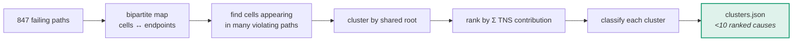
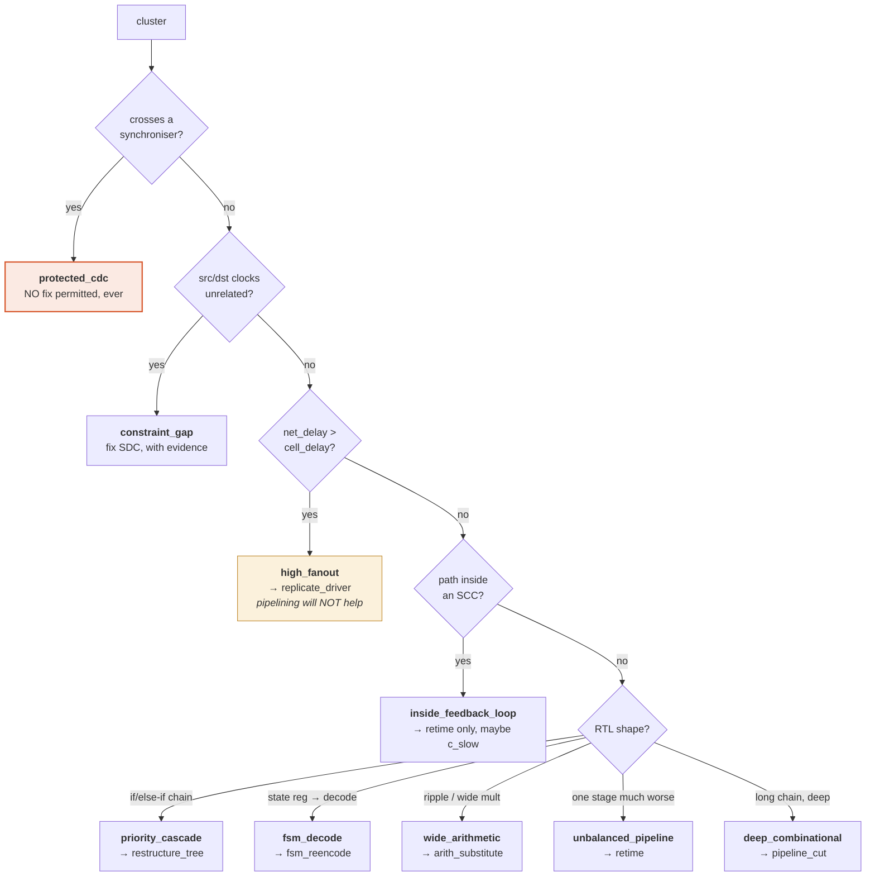

# M05 — Diagnosis engine

> Turns hundreds of failing timing paths into a short ranked list of **root causes**, each labelled with the fix family that could legally address it.

| | |
|---|---|
| **Owner** | HW-B |
| **Days** | 5 (24–30 Aug) |
| **Tier** | 1 |
| **Depends on** | M02, M03 |
| **Blocks** | M06, M08 |

## 1. Why grouping matters

A timing report lists **paths**. Paths are symptoms. Thirty failing endpoints frequently share one slow adder — fix the adder and all thirty disappear. A system attacking the single worst path fixes it and immediately meets the next worst path with the same cause.

**Rank clusters by TNS contribution, not by worst slack.**



## 2. The classification taxonomy — the technical core

**The cause determines which transformation is even legal.** Getting this wrong means confidently proposing the wrong fix.



## 3. The detail that signals real understanding

```python
# src/diagnose/classify.py
def classify(cluster, graph, timing):
    # ORDER MATTERS. Protected first — never propose a fix for a CDC path.
    if any(graph.nodes[c].get("protected") for c in cluster.shared_cells):
        return "protected_cdc", 1.0

    if not same_async_group(timing.clocks, cluster.launch_clock, cluster.capture_clock):
        return "constraint_gap", 0.9

    # THE SPLIT THAT MOST TEAMS IGNORE.
    # Published measurements on real cores found interconnect at ~2/3 of
    # critical path delay, driven by high-fanout control signals.
    # If delay is mostly wire, pipelining the LOGIC achieves nothing.
    if cluster.net_delay_ns > cluster.cell_delay_ns:
        return "high_fanout", 0.85

    if graph.in_scc(cluster.shared_cells):
        return "inside_feedback_loop", 0.95
    ...
```

## 4. Clustering algorithm

```
FUNCTION cluster(paths, graph):
    cell_to_endpoints = defaultdict(set)
    FOR p IN paths WHERE p.slack_ns < 0:
        FOR c IN p.cells:
            cell_to_endpoints[c].add(p.endpoint)

    # a "root" is a cell on many violating paths that is not a fanout leaf
    roots = [c FOR c, eps IN cell_to_endpoints
             IF len(eps) >= max(2, 0.05 * len(paths))]

    clusters = merge_overlapping(roots, cell_to_endpoints)
    FOR cl IN clusters:
        cl.tns_contribution_ns = sum(-p.slack_ns FOR p IN paths
                                     IF p.endpoint IN cl.endpoints)
        cl.rtl_region = graph.rtl_span(cl.shared_cells)   # ← the representation step
        cl.diagnosis, cl.confidence = classify(cl, graph, timing)
        cl.evidence = render_paragraph(cl)   # human-readable, goes in the bundle
    RETURN sorted(clusters, key=lambda c: -c.tns_contribution_ns)
```

## 5. Definition of done

- [ ] 800+ failing paths reduce to **fewer than 10** ranked clusters on the damaged benchmark
- [ ] Every cluster correctly classified against the known injected fault
- [ ] `rtl_region` resolves to the right file and line span
- [ ] `cell_delay_fraction` populated and driving the high-fanout branch
- [ ] Protected CDC paths never appear with a fix family

## 6. Failure modes

| Symptom | Cause | Fix |
|---|---|---|
| One giant cluster containing everything | Root threshold too low | Raise the 5% floor; exclude buffers/inverters from root candidacy |
| Every path its own cluster | Not merging overlapping root sets | `merge_overlapping` must be transitive |
| Wrong fix family proposed | `net_delay_ns` not populated by M02 | Fix the parser first (M02 §5) |
| CDC paths get fix suggestions | `protected` attribute not propagated from M04 | M04 must run before M05 in the loop |
