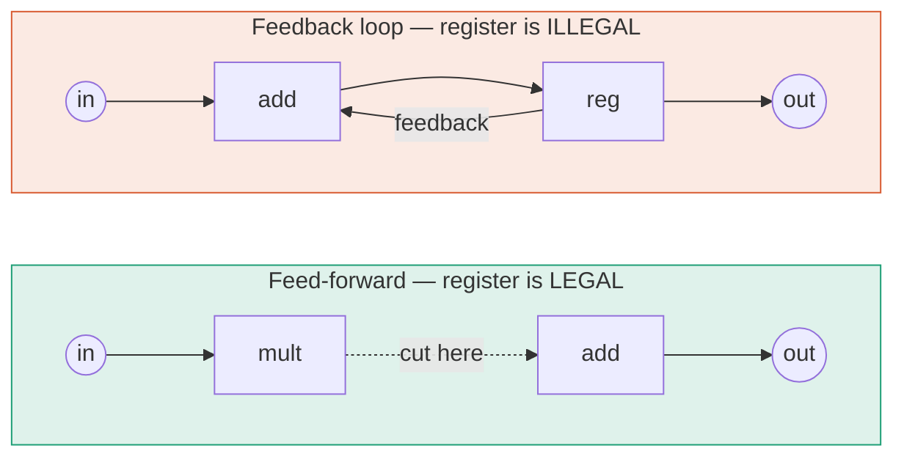
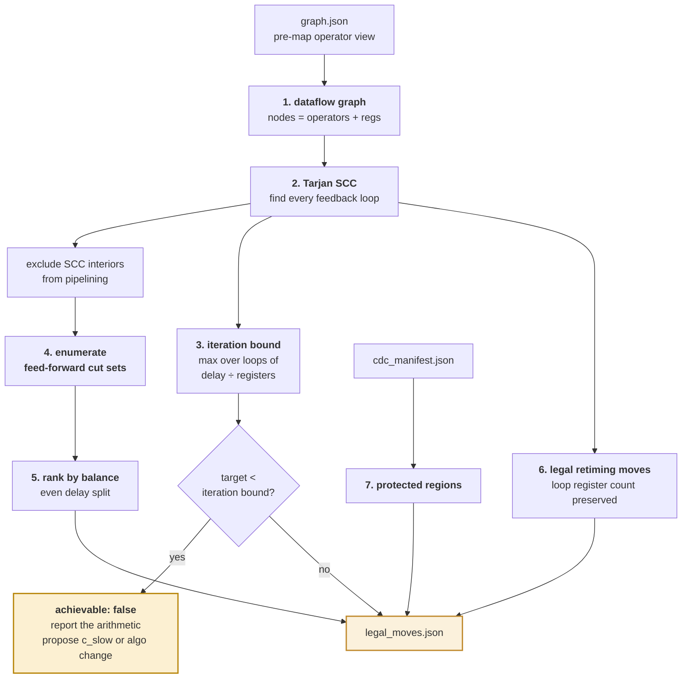

# M06 — Legality analyser ★

> Computes the complete **finite menu** of transformations that are legal at a given point. This is the mechanism behind *legality-constrained* in the project title.

| | |
|---|---|
| **Owner** | HW-A, with SW-1 on graph algorithms |
| **Days** | 7 (26 Aug – 3 Sep) |
| **Tier** | 1 |
| **Depends on** | M03, M04, M05 |
| **Blocks** | M07, M08 |

## 1. Why this is the intellectual core

Every other system in this space lets the model generate freely and filters afterwards — correctness enforced *after the fact* by expensive tools that sometimes cannot decide. We move the decision **before** the model, into cheap deterministic analysis.

The model is then only ever asked the question it is genuinely good at: *given these five legal options, which helps most here?*

> **Diagnostic:** if the model appears to be doing something clever, this module is underbuilt.

## 2. The rule, in plain terms

You may insert a pipeline register **anywhere data flows strictly forwards**. You may **not** insert one inside a feedback loop. An accumulator, counter, state machine or credit-based flow controller all contain feedback — a register inside one does not *delay* the answer, it *changes* the answer.



**Retiming rule:** registers may be *relocated* freely provided the number of registers around every loop is unchanged. That single condition is the entire legality rule for retiming.

## 3. Pipeline



## 4. Algorithms

### 4.1 Feed-forward cut set enumeration

A **cut set** divides the graph in two. It is **feed-forward** if every crossing edge points the same way. Classical retiming theory guarantees adding a register to every edge of such a cut leaves the computation unchanged and merely delays the output by one cycle.

```python
# src/legality/cutsets.py
import networkx as nx

def feed_forward_cuts(dfg: nx.DiGraph, max_cuts: int = 50) -> list[dict]:
    """Enumerate legal pipeline insertion points in the acyclic regions."""
    # 1. collapse each SCC to a single node — loops are off-limits
    cond = nx.condensation(dfg)                    # DAG of SCCs
    order = list(nx.topological_sort(cond))

    cuts = []
    for k in range(1, len(order)):
        upstream = set(order[:k])
        crossing = [(u, v) for u, v in cond.edges()
                    if (u in upstream) != (v in upstream)]
        # feed-forward iff every crossing edge goes upstream -> downstream
        if all(u in upstream for u, v in crossing):
            cuts.append({
                "cut_id": f"cut_{k:03d}",
                "edges": [expand_to_real_edges(dfg, cond, e) for e in crossing],
                "upstream_delay_ns":   max_delay(dfg, upstream),
                "downstream_delay_ns": max_delay(dfg, set(order[k:])),
            })
    return rank_by_balance(cuts)[:max_cuts]


def rank_by_balance(cuts):
    """A good cut splits path delay evenly. balance = 1.0 is perfect."""
    for c in cuts:
        u, d = c["upstream_delay_ns"], c["downstream_delay_ns"]
        c["balance_score"] = 1.0 - abs(u - d) / max(u + d, 1e-9)
    return sorted(cuts, key=lambda c: -c["balance_score"])
```

### 4.2 Iteration bound — the honest-failure capability

```python
# src/legality/bound.py
def iteration_bound(dfg) -> tuple[float, dict]:
    """The hard floor on clock period. No retiming or pipelining beats this.

    For each loop: bound = (combinational delay around it) / (registers in it).
    The maximum across all loops is the design's iteration bound.
    """
    worst, worst_loop = 0.0, None
    for cycle in nx.simple_cycles(dfg):           # cap on large designs
        delay = sum(dfg.nodes[n].get("delay_ns", 0.0) for n in cycle)
        regs  = sum(1 for n in cycle if dfg.nodes[n]["kind"] == "reg")
        if regs == 0:
            raise CombinationalLoop(cycle)        # a real design bug
        b = delay / regs
        if b > worst:
            worst, worst_loop = b, {"cycle": cycle, "delay_ns": delay, "registers": regs}
    return worst, worst_loop
```

When `target_period_ns < iteration_bound_ns`, the correct output is **not a patch**:

```json
{
  "achievable": false,
  "iteration_bound_ns": 2.84,
  "unachievable_reason":
    "Target 2.00 ns is below the iteration bound of 2.84 ns. Loop through
     acc_reg -> add_u1 -> sat_u2 -> acc_reg has 2.84 ns of combinational delay
     across 1 register (rtl/core/accum.v:88-104). No pipelining or retiming can
     reach the target. Options: (a) C-slow by 2 if two independent streams exist,
     giving 1.42 ns; (b) restructure the accumulation algorithmically.",
  "moves": [ { "kind": "c_slow", "params": {"c": 2}, ... } ]
}
```

> **Film this.** A system that knows when to stop, and proves why, reads as far more expert than one that always emits a patch.

### 4.3 Retiming legality

```
FUNCTION legal_retiming_moves(dfg):
    moves = []
    FOR reg IN dfg.registers():
        FOR direction IN {forward, backward}:
            candidate = move_register(dfg, reg, direction)
            # THE ONLY RULE: every loop keeps its register count
            IF all(count_regs(c) unchanged FOR c IN cycles_through(reg)):
                IF no_protected_cell_crossed(candidate):
                    moves.append(RetimeMove(reg, direction,
                                 predicted_gain=delay_delta(candidate)))
    RETURN moves
```

### 4.4 Verification boundary classification

Consumed by M09 to decide where to build the miter.

```python
def classify_interface(graph, module):
    """Where must the equivalence proof be drawn?"""
    ports = graph.ports_of(module)
    if has_valid_ready_handshake(ports):
        return {"interface_kind": "latency_insensitive",
                "boundary": module,
                "note": "latency is part of the contract; modular proof holds"}
    return {"interface_kind": "fixed_latency",
            "boundary": graph.parent_of(module),
            "note": "boundary raised one level to include control-path delay adjustment"}
```

## 5. Build order

| Day | Deliverable | Test |
|---|---|---|
| 1 | Dataflow graph from pre-map view | Hand-drawn 6-node example matches |
| 2 | Tarjan SCC + condensation | Accumulator fixture returns exactly one SCC |
| 3 | Feed-forward cut enumeration | On a 3-stage feed-forward chain: exactly 2 cuts |
| 4 | Balance ranking + delay estimates | Best cut splits a known-unbalanced path evenly |
| 5 | Iteration bound + unachievable reporting | Loop-bound fixture returns `achievable: false` with correct arithmetic |
| 6 | Retiming moves + protected-region exclusion | No move ever touches a cell in `protected_cells` |
| 7 | Interface classification, schema-valid export | Handshake module → `latency_insensitive` |

## 6. Definition of done

- [ ] The legal menu for a cluster **provably contains** the known-correct fix from M01's fault manifest
- [ ] The menu **provably excludes** every illegal option (no cut inside an SCC, ever)
- [ ] No move targets a cell listed in `cdc_manifest.protected_cells`
- [ ] Iteration bound correct on a hand-computed fixture
- [ ] `achievable: false` produced with correct arithmetic when the target is below the bound
- [ ] Runs in under 5 s per cluster

## 7. Failure modes

| Symptom | Cause | Fix |
|---|---|---|
| Cuts proposed inside loops | Condensation not applied, or SCCs computed on post-map view | Compute on the **pre-map operator view** |
| `simple_cycles` never returns | Exponential on large graphs | Bound to SCCs only; cap cycle length; memoise |
| Every cut ranked equally | Delay estimates missing | Annotate operator delays from the Liberty file |
| Menu is empty | Over-strict protection or all paths in SCCs | Log the exclusion reason for each rejected cut — you need this for the evidence bundle anyway |
| Model picks nonsense | Menu lacks `legality_proof.detail` | That field is what the human reads. Never leave it blank. |
