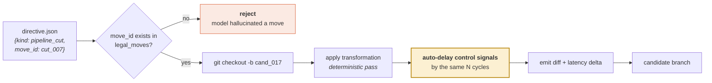

# M07 — Transformation engine

> The code that actually edits the design. Takes a structured **instruction** and performs the edit deterministically. **The model never writes the Verilog.**

| | |
|---|---|
| **Owner** | HW-B |
| **Days** | 6 (28 Aug – 4 Sep) |
| **Tier** | 1 |
| **Depends on** | M06, M08 |
| **Blocks** | M09 |

## 1. Why the model does not write the code

If an LLM emits Verilog directly it can produce syntax errors, non-synthesisable constructs, accidentally inferred latches and quietly changed bit widths. If instead it emits an **instruction** and our code performs the edit, that entire failure class disappears.



## 2. Build order — easiest first

| # | Transformation | What it does | Latency | Build |
|---|---|---|---|---|
| 1 | `replicate_driver` | duplicates a high-fanout driver so each copy drives fewer loads | unchanged | day 1 |
| 2 | `restructure_tree` | rebuilds a priority cascade / operator chain as a balanced tree | unchanged | day 2 |
| 3 | `retime` | relocates existing registers across combinational logic | unchanged | day 3 |
| 4 | `pipeline_cut` | inserts a register stage on a legal feed-forward cut | **+N** | day 4 |
| 5 | `fsm_reencode` | changes state encoding, e.g. binary → one-hot | unchanged | day 5 |
| 6 | `arith_substitute` | swaps ripple adder for carry-select, etc. | varies | day 6 |

## 3. The failure mode to design against

> When a datapath is pipelined, **every control signal accompanying the data must be delayed by the same number of cycles.**

This is the single most common pipelining mistake and it is exactly what an unaided LLM gets wrong: it pipelines the data and forgets the `valid` signal. Because *our engine* performs the edit, we make the control-path delay **automatic** rather than hoping it was remembered.

```python
# src/transform/pipeline.py
def apply_pipeline_cut(rtl, move, graph):
    """Insert one register stage on a feed-forward cut.
    CRITICAL: auto-delay every control signal that travels with the data."""
    edges = move["target"]["cut_edges"]

    # 1. insert the datapath registers
    for e in edges:
        insert_register_on_net(rtl, e, name=f"pipe_{move['move_id']}_{e}")

    # 2. THE STEP AN LLM FORGETS.
    #    Find every control signal whose consumers are downstream of the cut
    #    and delay it by the same amount.
    for ctrl in graph.control_signals_crossing(edges):
        insert_register_on_net(rtl, ctrl, name=f"pipe_{move['move_id']}_{ctrl}_d")

    # 3. record what we did, for the evidence bundle
    return {"latency_delta": 1,
            "registers_added": len(edges) + len(ctrl_signals),
            "control_signals_delayed": [c.name for c in ctrl_signals]}
```

## 4. Two implementation routes

| Route | How | Pros | Cons |
|---|---|---|---|
| **Yosys pass** | manipulate RTLIL, re-emit Verilog | structurally safe, no parsing | output loses the original formatting and comments |
| **Source rewrite** | targeted textual edit guided by `src` line info | preserves readable RTL, produces a reviewable diff | more fragile |

> **Use source rewrite for anything a human will review** (which is everything, since the diff goes into the evidence bundle). Fall back to a Yosys pass for `retime`, which is genuinely structural.

## 5. Git discipline

Every candidate is a branch. Winners merged, losers deleted. The commit history becomes a readable log of what the system tried.

```bash
git checkout -b cand/iter03_cut007 main
# ... apply ...
git commit -m "pipeline_cut cut_007 in descrambler (+1 cycle latency)

move_id: cut_007
legality: feed_forward_cutset
rationale: <model rationale verbatim>
predicted_gain_ns: 0.42"
```

## 6. Definition of done

- [ ] Every transformation applies from a directive and produces **synthesisable** output
- [ ] `move_id` not present in `legal_moves` → **hard reject**, logged as a model error
- [ ] Pipelining auto-delays control signals; a test proves the `valid` signal moved too
- [ ] Every branch reverts cleanly with `git checkout main`
- [ ] Diff is human-readable — a reviewer can see what changed without a tool
- [ ] Never edits a cell in `protected_cells` (assert this, do not assume it)

## 7. Failure modes

| Symptom | Cause | Fix |
|---|---|---|
| Equivalence fails on every pipelining | Control signals not delayed | §3 — this is the classic |
| Diff unreadable | Yosys re-emitted the whole module | Use source rewrite for reviewable transformations |
| Bit widths silently changed | Textual rewrite without width awareness | Read width from the graph; assert unchanged after edit |
| Branch pollution | Losers not deleted | Prune in M10's rollback path |
