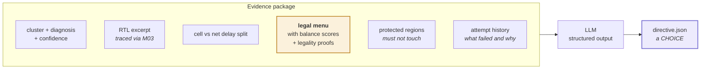
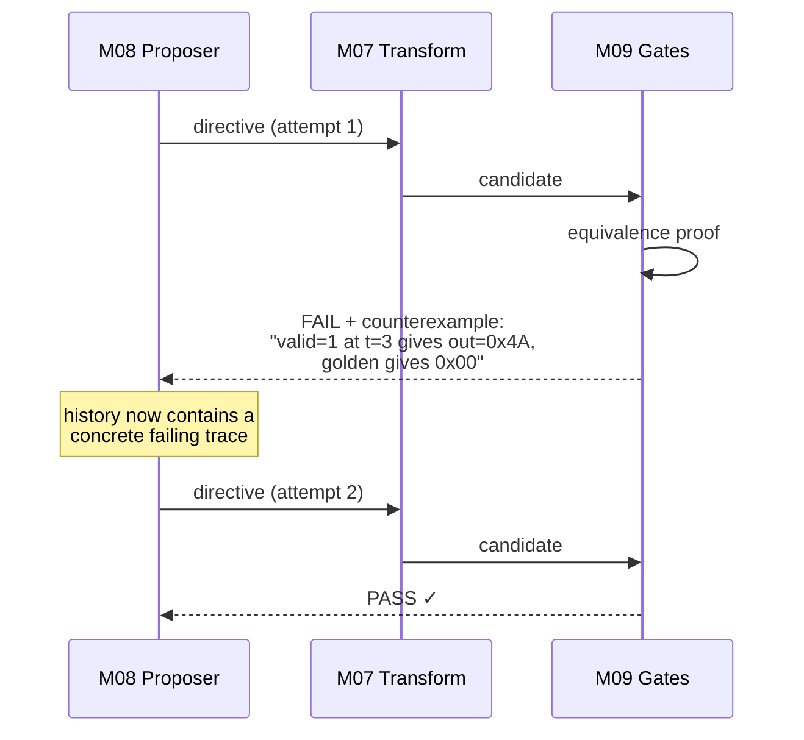
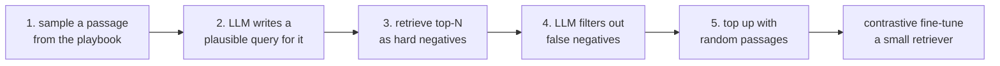

# M08 — Generative proposer and domain retrieval

> The only non-deterministic component in the system. It receives evidence and a menu, and returns a **choice**.

| | |
|---|---|
| **Owner** | SW-1 |
| **Days** | 7 (27 Aug – 6 Sep) |
| **Tier** | 1 (selection mode) / 3 (retrieval fine-tuning) |
| **Depends on** | M05, M06 |
| **Blocks** | M07 |

## 1. What it is given — never a raw timing report



## 2. Two modes — and comparing them is a **result**

| | Selection mode | Generation mode |
|---|---|---|
| Model output | a `move_id` from the menu | RTL source |
| Syntax risk | **structurally zero** | real |
| Covers | pipelining, retiming, replication, restructuring | FSM restructure, algorithmic rewrite |
| Verification cost | normal | full |
| Expected rejection rate | low | high |

Report compile rate, proof rate, slack gained and area cost **for each mode separately**. A finding of the form *"directive-driven transformations achieved a far higher acceptance rate than free-form generation at comparable slack improvement"* is a research result, not a demo.

## 3. Structured output contract

```python
# src/proposer/schema.py — the tool/function the model must call
PROPOSE_TOOL = {
  "name": "propose_transformation",
  "description": "Choose ONE transformation from the supplied legal menu.",
  "input_schema": {
    "type": "object",
    "required": ["mode", "rationale", "declared_latency_delta"],
    "properties": {
      "mode": {"enum": ["selection", "generation"]},
      "move_id": {"type": "string",
                  "description": "MUST be one of the move_id values in legal_moves. "
                                 "Any other value is a hard error."},
      "generated_rtl": {"type": "string"},
      "declared_latency_delta": {"type": "integer"},
      "predicted_gain_ns": {"type": "number"},
      "rationale": {"type": "string",
                    "description": "2-4 sentences. A human reads this VERBATIM in the "
                                   "evidence bundle. Explain why this option beats the "
                                   "others in the menu, referencing the timing evidence."}
    }
  }
}
```

```python
# src/proposer/propose.py
def propose(cluster, legal_moves, rtl_excerpt, history, model="claude-sonnet-4-6"):
    if not legal_moves["achievable"]:
        # Do NOT ask the model to solve an impossible problem.
        return report_unachievable(legal_moves)

    resp = call_model(system=SYSTEM, tools=[PROPOSE_TOOL],
                      messages=[{"role": "user",
                                 "content": render_evidence(cluster, legal_moves,
                                                            rtl_excerpt, history)}])
    d = extract_tool_call(resp)

    # HARD VALIDATION — the model does not get the benefit of the doubt
    if d["mode"] == "selection":
        valid = {m["move_id"] for m in legal_moves["moves"]}
        if d["move_id"] not in valid:
            raise HallucinatedMove(d["move_id"], valid)   # logged as a model error
        move = next(m for m in legal_moves["moves"] if m["move_id"] == d["move_id"])
        if d["declared_latency_delta"] != move["latency_delta"]:
            d["declared_latency_delta"] = move["latency_delta"]   # menu is ground truth
    return validate(d, "directive")
```

## 4. Counterexample repair — the loop that films beautifully

When a formal proof fails it does not merely say no. It returns a **concrete input sequence** on which the two versions disagree.



Report the **repair rate**: how much more often attempt 2 succeeds than attempt 1. That is a measurable claim about the design working.

## 5. Domain retrieval — borrowed from ChipNeMo (tier 3)

Maintain a playbook: transformation patterns paired with the situations they suit, plus a CDC pattern library. Retrieve relevant entries rather than relying on model recall.

ChipNeMo's sample-generation recipe, replicated cheaply:



They reported roughly doubling hit rate over an off-the-shelf retriever with ~3000 auto-generated samples. **Tier 3 — do not let this displace M10.**

## 6. Definition of done

- [ ] Produces valid directives for every cluster type in the benchmark
- [ ] **Hallucinated `move_id` is caught and logged**, never passed to M07
- [ ] Rationale is specific — references the actual timing evidence, not generic advice
- [ ] Post-counterexample retry succeeds measurably more often than the first attempt
- [ ] Returns `unachievable` report (not a patch) when `achievable: false`
- [ ] Selection vs generation statistics collected per run

## 7. Failure modes

| Symptom | Cause | Fix |
|---|---|---|
| Model invents `move_id`s | Menu not in the prompt, or too long | Cap at 8 moves; put them in a numbered list; validate hard |
| Rationale is generic boilerplate | Evidence package too thin | Include actual slack numbers and RTL lines, not summaries |
| Always picks the first option | No balance scores supplied | M06 must populate `balance_score` |
| Latency delta wrong | Model guessed instead of reading the menu | Overwrite from the menu — it is ground truth |
| SW-1 spending days on prompts | The prompt-engineering trap | If the model looks clever, M06 is underbuilt. Go fix M06. |
