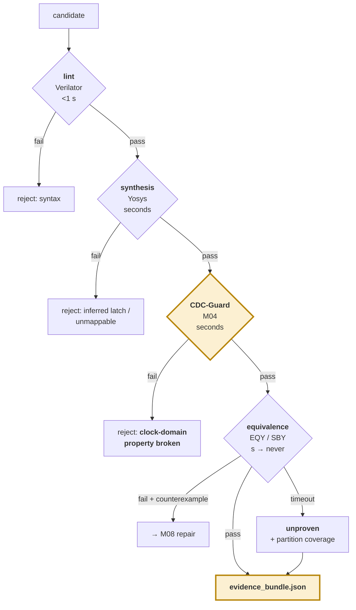

# M09 — Evidence bundle: four gates, one signed artefact ★

> **THE PRODUCT SURFACE.** What turns a forty-minute review into a two-minute one.

| | |
|---|---|
| **Owner** | HW-A, with SW-1 on rendering |
| **Days** | 7 (30 Aug – 7 Sep) |
| **Tier** | 1 |
| **Depends on** | M04, M07 |
| **Blocks** | M10, M11 |

## 1. The four gates — cheap failures die cheaply



## 2. How equivalence checking works

Both versions are elaborated into a common form. A **miter** is constructed: a composite circuit feeding identical inputs to both designs, comparing corresponding outputs through XOR gates, reducing to one difference signal. Proving equivalence means proving that signal can never become true — exhaustively, not by sampling.

### Tiering by transformation class

| Transformation | Registers | Method | Tool |
|---|---|---|---|
| restructure, replicate | unchanged | combinational equivalence | EQY |
| retime, fsm_reencode | moved / redefined | sequential equivalence + induction | SBY, k-induction |
| **pipeline_cut** | **added** | **latency-adjusted miter** | SBY |

### The latency-adjusted miter

Pipelined designs are deliberately **not** equivalent — latency changed. Delay the golden outputs by N before comparing:

```systemverilog
// flow/formal/miter_latency.sv
module miter #(parameter N = 1) (input clk, rst_n, input [W-1:0] din, input vin);
    wire [W-1:0] g_out, r_out;
    wire         g_val, r_val;

    golden  u_g (.clk, .rst_n, .din, .vin, .dout(g_out), .vout(g_val));
    revised u_r (.clk, .rst_n, .din, .vin, .dout(r_out), .vout(r_val));

    // delay the GOLDEN outputs by N to match the revised pipeline depth
    reg [W-1:0] g_pipe [0:N-1];
    reg         v_pipe [0:N-1];
    integer i;
    always @(posedge clk) begin
        g_pipe[0] <= g_out; v_pipe[0] <= g_val;
        for (i = 1; i < N; i = i + 1) begin
            g_pipe[i] <= g_pipe[i-1]; v_pipe[i] <= v_pipe[i-1];
        end
    end

    // anchor to reset: only assert once the pipeline has filled
    reg [7:0] cyc; always @(posedge clk) cyc <= rst_n ? cyc + 1 : 8'd0;

    always @(posedge clk) if (rst_n && cyc > N) begin
        assert (v_pipe[N-1] == r_val);
        if (r_val) assert (g_pipe[N-1] == r_out);
    end
endmodule
```

## 3. Where to draw the boundary

> Proving only the changed module is valid **iff its interface contract is unchanged.**

| Interface | Latency part of contract? | Boundary |
|---|---|---|
| valid/ready handshake | yes | the module itself — modular proof holds |
| fixed latency | no | **one level up**, to include the control-path delay |

M06 records which case applies (`verification_boundary`); M09 obeys it. **Stating this rule explicitly in the report signals real understanding of formal verification.**

## 4. Two ways proofs fail for boring reasons

| Cause | Symptom | Fix |
|---|---|---|
| **Register name correspondence** — Yosys renames and merges registers, so state elements cannot be matched | proof fails on a change you know is correct | preserve hierarchy; `(* keep *)` on state; use `eqy` partition hints |
| **Reset / initialisation** — two designs equivalent in steady state can differ after reset; k-induction without reachability produces spurious counterexamples | counterexample shows an impossible state | anchor to a reset sequence; add reachability invariants |

## 5. Partial credit on timeout

EQY partitions a design internally. On timeout, report the **fraction of partitions proven** rather than a bare failure.

```python
def equivalence_gate(golden, revised, boundary, timeout=300):
    r = run_eqy(golden, revised, boundary, timeout)
    if r.status == "PASS":
        return Gate("pass", tool="eqy", artefact=r.log)
    if r.status == "FAIL":
        return Gate("fail", reason=r.first_mismatch,
                    counterexample=r.trace)          # → M08 repair
    # TIMEOUT — calibration matters more than coverage
    return Gate("unproven",
                reason=f"solver timeout at {timeout}s",
                partition_coverage=r.proven / r.total)
```

> **`unproven` is never reported as `pass`.** A certificate that says PASS when a proof timed out is worse than no certificate — it destroys trust permanently. See [vision §2, calibration](../00-vision.md).

## 6. The bundle — what a reviewer actually sees

```json
{
  "candidate_id": "cand/iter03_cut007",
  "summary": "Pipeline descrambler at cut_007. +1 cycle latency, +0.42ns WNS, +180um2.",
  "rationale": "Cluster c02 is deep combinational logic with 82% of delay in cells,
                so pipelining applies. cut_007 has the best balance (0.94) of the five
                legal cuts, splitting the 2.9ns path into 1.5/1.4ns halves.",
  "legality": {
    "rule": "feed_forward_cutset",
    "move_id": "cut_007",
    "detail": "Cut lies in the acyclic region between descramble_stage and crc_stage.
               No SCC is crossed. Register insertion on all 3 crossing edges preserves
               the computation by the delay transfer theorem."
  },
  "gates": {
    "lint":        {"verdict":"pass","tool":"verilator","tool_version":"5.028","seconds":0.4},
    "synthesis":   {"verdict":"pass","tool":"yosys","tool_version":"0.44","seconds":11.2},
    "cdc":         {"verdict":"pass","tool":"cdcguard","tool_version":"0.9.1","seconds":3.1,
                    "artefact":"runs/cand017/cdc_certificate.json"},
    "equivalence": {"verdict":"pass","tool":"sby","tool_version":"0.44","seconds":47.0,
                    "artefact":"runs/cand017/miter.sby.log"}
  },
  "timing_delta": {
    "wns_before_ns": -0.51, "wns_after_ns": -0.09,
    "tns_before_ns": -18.4, "tns_after_ns": -2.1,
    "fmax_before_mhz": 392, "fmax_after_mhz": 478,
    "hold_wns_after_ns": 0.06,
    "area_delta_um2": 180, "new_violating_endpoints": 0
  },
  "latency_delta": 1,
  "scope_not_checked": ["power intent", "DFT", "X-propagation", "multicycle assertions"],
  "verdict": "accept"
}
```

Map each field to a trust property from [vision §2](../00-vision.md):

| Field | Trust property |
|---|---|
| `summary`, `rationale` | legibility |
| `gates[*].tool_version`, `artefact` | provenance |
| `verdict: unproven`, `partition_coverage` | calibration |
| pinned seeds in `run_record` | determinism |
| `counterexample` | falsifiability |
| **`scope_not_checked`** | **bounded scope** |

## 7. Definition of done

- [ ] All four gates run automatically; first failure stops the sequence
- [ ] A known-good pipelining change is **accepted**
- [ ] The gray-code rewrite is **rejected by the CDC gate while the equivalence gate passes** — capture this for the video
- [ ] Latency-adjusted miter proves a correct pipelining change
- [ ] Counterexample captured and fed back to M08
- [ ] `unproven` emitted on timeout, with partition coverage
- [ ] `scope_not_checked` non-empty in every bundle
- [ ] Bundle renders to a page a reviewer can act on **without opening the RTL**

## 8. Failure modes

| Symptom | Cause | Fix |
|---|---|---|
| Every proof fails | Register correspondence, or missing reset anchor | §4 |
| Proofs never terminate on multipliers | Whole design in one miter | Draw the boundary per M06's `verification_boundary`; cap and report `unproven` |
| Reviewer still opens the RTL | Bundle missing the diff or the rationale is vague | The bundle must be self-sufficient. That is the whole point. |
| Gate order wrong | Equivalence run before CDC | CDC is cheap and rejects hard — run it third, always |
