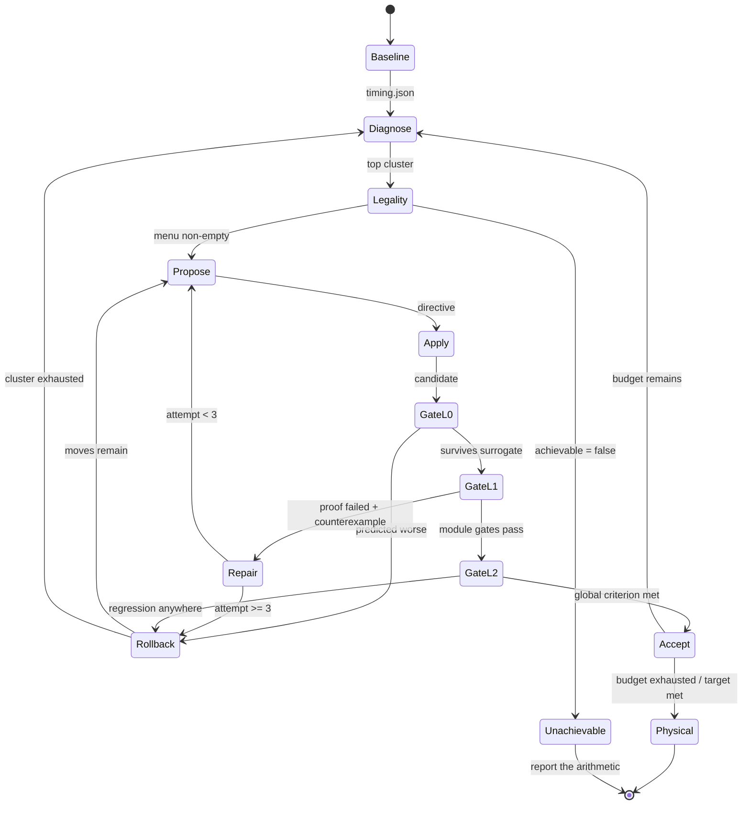

# M10 — Orchestrator and search controller

> The loop itself: which candidates to generate, how much to spend evaluating each, what to accept, when to stop.

| | |
|---|---|
| **Owner** | SW-1 |
| **Days** | 5 (1–8 Sep) |
| **Tier** | 1 |
| **Depends on** | M09 |
| **Blocks** | M11, M12, M13 |

## 1. State machine



## 2. The evaluation ladder — why a naive loop fails

Evaluating a candidate costs anywhere from a millisecond to half an hour. Running the full flow on every idea consumes the month.

| Tier | What runs | Cost | Candidates |
|---|---|---|---|
| **L0** | graph maths only: predicted depth, balance, area delta | ms | ~200 |
| **L1** | incremental synth + STA of the changed module + formal | seconds | ~20 |
| **L2** | full design, **both corners**, area, power | minutes | ~5 |
| **L3** | place and route (M12) | ~30 min | 2 |

> **Rule: never run an expensive tier on something a cheap tier could have rejected.**

## 3. The accept criterion **must be global**

Three traps:

1. Fixing the worst path merely **promotes the next one**.
2. Transformations **interact** — pipelining module A changes its area, which changes placement, which changes wire delay in module B.
3. WNS and TNS can move in **opposite directions**; greedily chasing one worsens the other.

```python
# src/orchestrator/accept.py
def accept(before, after, budget) -> tuple[bool, str]:
    """ALL must hold. Any single failure is a rollback."""
    checks = [
        (after.wns_ns >= before.wns_ns - 1e-9,      "WNS regressed"),
        (after.tns_ns >  before.tns_ns,             "TNS did not improve"),
        (after.new_violating_endpoints == 0,        "new violating endpoints appeared"),
        (after.hold_wns_ns >= 0,                    "hold violation created at fast corner"),
        (after.area_um2 <= budget.area_um2,         "area budget exceeded"),
        (after.power_mw <= budget.power_mw,         "power budget exceeded"),
        (after.cdc_verdict == "safe_to_merge",      "CDC property broken"),
        (after.latency_delta <= budget.latency,     "latency budget exceeded"),
    ]
    for ok, why in checks:
        if not ok:
            return False, why
    return True, "all criteria met"
```

## 4. Caching and provenance

```python
# src/orchestrator/cache.py
def cache_key(inputs: dict) -> str:
    """Content-addressed. Nothing is ever recomputed, and every number
    traces to the exact inputs and tool versions that produced it."""
    payload = {"inputs": inputs,
               "tools": tool_versions(),          # from M00
               "seed": os.environ["RTLAGENT_SEED"]}
    return hashlib.sha256(canonical_json(payload).encode()).hexdigest()[:16]
```

Every candidate is a **git branch**. Winners merged, losers deleted. The commit history becomes a readable log of what the system tried and why.

## 5. Beam search over candidates

Generate several candidates per cluster rather than one, evaluate in parallel through the ladder, keep the **Pareto front** across frequency, area and latency. This produces a Pareto plot for the report rather than a single before/after bar — a much stronger visual.

## 6. Definition of done

- [ ] Runs unattended on the damaged benchmark and terminates with a documented reason
- [ ] Accepts and rejects correctly against the global criterion
- [ ] Ladder measured: report actual candidate counts and wall-clock per tier
- [ ] Cache hit rate reported; nothing recomputed
- [ ] Every candidate on its own branch; losers pruned
- [ ] `run_record.json` schema-valid with full provenance
- [ ] Handles `achievable: false` by reporting, not looping

## 7. Failure modes

| Symptom | Cause | Fix |
|---|---|---|
| Loop never terminates | No budget or no progress detection | Cap iterations; stop when no legal move improves anything |
| Local wins, global loss | Accepting on module-level timing | Always re-measure the **whole** design at L2 |
| Runs take hours | L2 on every candidate | Enforce the ladder; check the L0 rejection rate is high |
| Numbers not reproducible | Seed unpinned or cache key missing tool versions | §4 |
