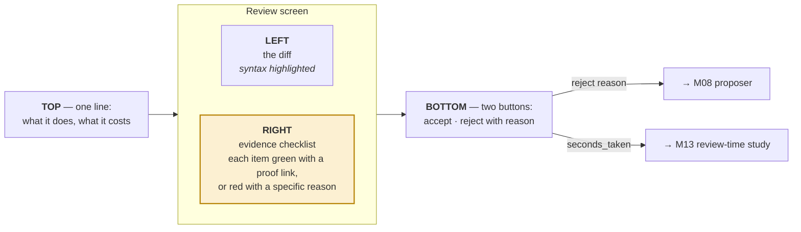

# M11 — Review console

> The interface a judge actually sees, and the instrument that measures our headline metric.

| | |
|---|---|
| **Owner** | SW-1, with HW-B absorbing polish from week 4 |
| **Days** | 4 (4–10 Sep) |
| **Tier** | 2 |
| **Depends on** | M09, M10 |
| **Blocks** | M13 (review-time study) |

## 1. Design it as a code review tool, not a dashboard

The unit of interaction is **one proposed change**.

**The console must start a timer when the patch is displayed and record `seconds_taken` on decision.** That number is the raw data for the headline experiment. Build the timer on day one of this module, not last.

## 2. Also: a live run view

Current WNS, the cluster under attack, the legal menu generated, the option chosen and its reason, the verdict from each gate. **This is the footage for the video.**

## 3. Frame it as a service, not a script

> The system watches an RTL repository and, on each change, diagnoses, proposes, certifies, and comments with an evidence-backed patch — the way a code review bot does.

That framing turns *"we built a tool"* into *"we built something an engineer would put in their flow on Monday."*

## 4. Definition of done

- [ ] Renders any `evidence_bundle.json` without special-casing
- [ ] Timer starts on display, `seconds_taken` recorded on decision
- [ ] Reject reasons feed back to M08
- [ ] Every green item links to its artefact; every red item names a `file:line`
- [ ] A reviewer can decide **without opening the RTL** — test this on a real person
- [ ] `scope_not_checked` is visible, not buried
