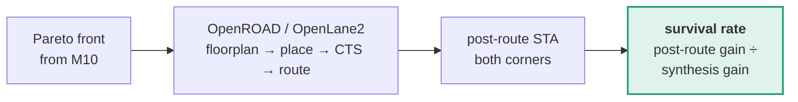

# M12 — Physical confirmation

> Run the best few candidates through actual place and route, to check the gains survive real wiring.

| | |
|---|---|
| **Owner** | HW-B |
| **Days** | 3 (6–9 Sep) |
| **Tier** | 2 |
| **Depends on** | M10 |

## 1. Why it matters more than it looks

Synthesis-level timing ignores wire delay and uses estimates. Optimisations that look excellent there routinely shrink or vanish after placement and routing.

**Almost nobody at a hackathon does this step** because it is slow and annoying. That is precisely why doing it separates our numbers from everyone else's estimates.

## 2. Scope it carefully — this is the honest move

The default flow is tuned for single-clock designs. **Clock tree synthesis across five asynchronous domains with generated clocks is genuinely hard**, and we may hit failures unrelated to our work.

> Run the physical step on **representative blocks**, not the whole benchmark, and say so plainly in the report. An honest partial result beats an unexplained missing section.

## 3. Definition of done

- [ ] At least two accepted candidates have post-route timing at both corners
- [ ] Survival rate reported: what fraction of the predicted gain remained
- [ ] Scope limitation stated explicitly in the report
- [ ] Routed area reported alongside synthesis area

## 4. Failure modes

| Symptom | Cause | Fix |
|---|---|---|
| CTS fails on 5 domains | Flow assumes one clock tree | Constrain per-domain; or scope to a single-domain block and say so |
| Post-route much worse than synthesis | Congestion from added registers | Report it — this is a genuine finding, not a failure |
| Runs take hours | Whole benchmark through P&R | Representative blocks only. It is tier 2. |
