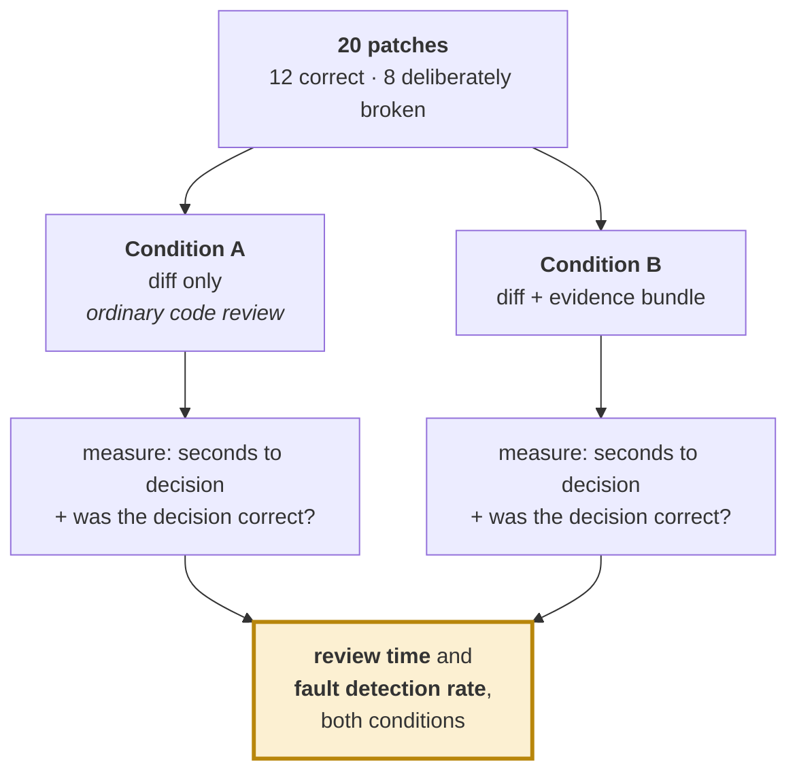

# M13 — Evaluation harness and the review-time study

> This section decides whether we win. Most entrants will show one before-and-after slack comparison. Ours should read like a paper's results section.

| | |
|---|---|
| **Owner** | HW-A (you) |
| **Days** | 4 (5–12 Sep) |
| **Tier** | 1 |
| **Depends on** | M10, M11 |

## 1. The headline experiment — review time

**Nobody in this field runs this experiment.** It directly measures the bottleneck the whole project is built around, and it is cheap.



### The eight injected faults — realistic, not toy

| # | Fault | Catchable by |
|---|---|---|
| 1 | gray-code rewrite (equivalent, unsafe) | **only** CDC-Guard |
| 2 | synchroniser depth reduced 2 → 1 | **only** CDC-Guard |
| 3 | reset domain crossing introduced | **only** CDC-Guard |
| 4 | `valid` signal not delayed after pipelining | equivalence |
| 5 | register inserted inside a feedback loop | equivalence |
| 6 | false path asserted without justification | legality justification |
| 7 | area regression beyond budget | timing delta |
| 8 | hold violation created at the fast corner | timing delta |

> Faults 1–3 are the point. Expect condition A reviewers to miss most of them and condition B reviewers to catch all of them, because the certificate simply says so.

### Protocol

- **Participants:** your two hardware engineers plus 3–4 external volunteers with RTL experience (classmates, seniors).
- **Randomise patch order.** Counterbalance conditions so nobody sees the same patch twice.
- **Blind to condition purpose** — do not tell participants what you expect.
- **Report:** mean seconds per patch and detection rate, per condition, with **n stated plainly**.

### Be honest about its limits

Small sample. Partly our own team. Not a controlled laboratory study. **Call it a pilot study, state the confounds, and report it anyway.** Reviewers at this level respect a measured limitation far more than an unmeasured claim.

> **Why this beats any timing number.** A slack improvement is interesting to an engineer. A review-time reduction is interesting to the person who decides headcount.

## 2. The rest of the results table

| Experiment | What it establishes | Tier |
|---|---|---|
| **CDC-Guard detection rate.** Across injected clock-domain faults, what fraction does the certificate catch vs formal equivalence? | The core claim, in one number. Expect equivalence to catch close to none. **This comparison does not exist in the published literature.** | 1 |
| **Ground-truth recovery rate.** Did the system find the known-correct transformation from M01's fault manifest, not merely improve slack? | That the system is right rather than lucky. | 2 |
| **Model vs random selection** from the same legal menu. | Whether the model adds value or M06 does all the work. The bravest experiment here — respected whichever way it comes out. | 3 |
| **Selection vs generation mode** on compile rate, proof rate, slack gained. | That constraining the action space measurably improves reliability. | 3 |
| **Multi-corner closure**: setup at slow, hold at fast, plus area and power. | That we understand what timing closure actually requires. | 1 |
| **Post-route survival**: fraction of synthesis gain remaining after routing. | That our numbers are real rather than estimates. | 2 |
| **Counterexample repair rate**: success on retry after a failed proof. | That the feedback loop works as designed. | 3 |
| **Cost per accepted change**: tool invocations and wall-clock. | That the system is practical, not merely possible. | 3 |

## 3. Report failures as findings

ChipNeMo is the model here: they report that low-rank adaptation underperformed full training and that a larger learning rate degraded almost everything. **That candour is why the paper reads as trustworthy.** If our model fails to beat random selection on some cluster type, say so and explain why.

## 4. Reproducibility

```bash
make report    # regenerates EVERY number and figure in the paper from scratch
```

**Build this early, not late.** On 10 September we will want to re-run everything after a bug fix. Doing that by hand is how deadlines are missed.

Pin tool versions and seeds; stamp both into every run record. Synthesis and placement are both sensitive to them — without pinning you will attribute noise to your optimiser. **Report variance across repeated runs.**

## 5. Definition of done

- [ ] `make report` reproduces every number and figure from scratch
- [ ] Review-time study run with ≥5 participants, data in `runs/study/`
- [ ] CDC detection comparison table complete
- [ ] Variance across 3 repeated runs reported
- [ ] Every claim in the report traces to a command
